_Note: Source document was split into 5 OCR chunks (pages 1-17, pages 18-32, pages 33-47, pages 48-63, pages 64-71) to stay within token limits._

# 202506-ai-insurance-greater-china-report

## Page 1
# AI Impact on Insurance Industries in Greater China

**JUNE | 2025**

## Page 2
# AI Impact on Insurance Industries in Greater China 

AUTHORS Jian Gang He, FSA, FCIA

Hong Li, FSA, ACIA

## Give us your feedback! Take a short survey on this report.

## Caveat and Disclaimer

The opinions expressed and conclusions reached by the authors are their own and do not represent any official position or opinion of the Society of Actuaries Research Institute, the Society of Actuaries, or its members. The Society of Actuaries Research Institute makes no representation or warranty to the accuracy of the information.

Copyright © 2025 by the Society of Actuaries Research Institute. All rights reserved.

## Page 3
# CONTENTS 

Executive Summary ..... 5
Key Findings ..... 5
Challenges ..... 6
Outlook ..... 6
Section 1 Introduction ..... 8
Section 2 Background ..... 9
2.1 Early AI Applications in Insurance. ..... 9
2.2 Widespread Adoption by 2020 ..... 9
2.3 Business Drivers ..... 10
2.4 Case Studies ..... 10
2.5 Pre-ChatGPT Summary ..... 11
Section 3 Methodology ..... 12
3.1 Pre-ChatGPT Public Source Collection ..... 12
3.2 Post-ChatGPT Public Source Collection ..... 12
3.3 Survey Design and Data Collection ..... 13
3.3.1 Insurance Companies Survey ..... 13
3.3.2 Academic Institutions Survey ..... 13
3.4 Data Integration ..... 13
3.5 Reliability and Limitations ..... 14
Section 4 Results Analysis ..... 15
4.1 Narrow AI in Insurance. ..... 15
4.1.1 Customer Service Automation ..... 15
4.1.2 Sales and Marketing. ..... 16
4.1.3 Underwriting and Risk Assessment ..... 16
4.1.4 Claims Handling. ..... 16
4.1.5 Fraud and Risk Management ..... 17
4.1.6 Summary ..... 17
4.2 Survey Findings: LLM Adoption in Chinese Insurance Companies ..... 17
4.2.1 Overall Adoption and Implementation Status. ..... 18
4.2.2 Primary Application Areas for LLMs. ..... 22
4.2.3 Customer Service Applications. ..... 23
4.2.4 Agent and Sales Support. ..... 25
4.2.5 Product Development. ..... 27
4.2.6 Underwriting Services. ..... 29
4.2.7 Claims Services ..... 32
4.2.8 Customer Demand Analysis and Marketing ..... 34
4.2.9 Internal Efficiency and Knowledge Management ..... 37
4.2.10 Challenges and Satisfaction ..... 39
4.2.11 Public Source Examples of LLM Applications ..... 42
4.2.12 Sunshine Insurance's "Zhengyan GPT" Initiative. ..... 42
4.2.13 PICC's "Shuzhi Lingxi" Model ..... 43
4.2.14 Ping An and China Life Collaborations ..... 43
4.2.15 Hong Kong and Singapore Context ..... 43
4.2.16 Interdisciplinary Academic Initiatives ..... 44
4.2.17 ZhongAn's AIGC White Paper Findings ..... 44
4.2.18 Policy and Regulatory Moves ..... 44
4.3 Survey Findings: LLM Adoption in Academic Institutions ..... 45

## Page 4
4.3.1 Engagement in LLM-Related Research ..... 45
4.3.2 Focus Areas of LLM Research Projects ..... 46
4.3.3 Collaboration with the Insurance Industry ..... 46
4.3.4 Integration of LLMs into Courses and Curriculum ..... 47
4.3.5 Student Exposure to LLM Technology ..... 49
4.3.6 Key Challenges Faced by Academic Institutions ..... 50
4.3.7 Perceived Opportunities and Benefits ..... 51
4.3.8 Modes of Academia-Industry Collaboration ..... 51
4.3.9 Student Feedback and Reception ..... 52
4.3.10 Summary of Insights ..... 53
Section 5 Conclusions ..... 54
5.1 Rapid Adoption with Efficiency as the Primary Driver ..... 54
5.2 Broad Application Across the Value Chain, led by Internal and Support Functions ..... 54
5.3 The Human-AI Collaboration Paradigm ..... 55
5.4 Key Challenges: Data, Cost, and Governance Issues Temper Progress ..... 56
5.5 Greater China as an Innovation Hotspot with Strategic Implications ..... 56
Section 6 Outlook ..... 58
6.1 From Efficiency Tool to Strategic Asset - Deepening AI Integration ..... 58
6.2 Ecosystem and Collaboration - Building an AI-Insurance Innovation Network ..... 58
6.3 Policy and Regulatory Needs: Ensuring Responsible AI Use in Insurance ..... 59
6.4 Talent and Culture: Preparing the Workforce for AI Transformation ..... 60
Appendix A: Original Survey Results ..... 62
A. 1 - Survey Questions (Translated to English) ..... 62
Appendix B: Insurance Companies Survey ..... 64
B. 1 - Survey Questions for Insurance Companies ..... 64
References ..... 70
About The Society of Actuaries Research Institute ..... 71

## Page 5
# AI Impact on Insurance Industries in Greater China 

## Executive Summary

This report examines how artificial intelligence (AI)—particularly large language models (LLMs)—is transforming the insurance sector in China and related regions, with parallel insights from academia. We review the industry's decade-long adoption of "narrow AI" (traditional machine learning and automation) ${ }^{1}$ and analyze recent developments since the emergence of ChatGPT through literature, case studies, and original survey data.

We present findings from two surveys conducted in early 2025: one of 21 Chinese insurance companies and another of 18 academic institutions with actuarial programs. These complementary perspectives reveal significant trends, challenges, and future directions for AI in insurance.

## KEY FINDINGS

Prior to ChatGPT, Chinese insurers widely applied AI in online sales, customer service chatbots, fraud detection, and automated underwriting. By 2021, nearly half were using AI in customer service and one-third in claims and sales channels. ${ }^{2}$ The release of ChatGPT in 2023 catalyzed a rapid expansion of LLM applications: over $60 \%$ of surveyed insurers now report having at least one LLM-based application in production, and all are actively exploring the technology.

Use cases are broad and growing. Internal process support is the most widely adopted application (95\%), followed by customer service ( $67 \%$ ), agent assistance (57\%), underwriting (52\%), and claims processing (52\%). Chatbots and knowledge-based Q\&A systems are dominant in customer-facing applications, with nearly all adopters reporting improvements in timeliness and efficiency. Meanwhile, insurers are beginning to apply LLMs in product development and customer analytics, though uptake in those areas remains more measured.

Implementation strategies are typically hybrids. A majority of insurers (71\%) co-develop LLM solutions with technology providers, while $62 \%$ also pursue in-house development. Among internal users, the open-source DeepSeek model dominates, used by over 90\% of self-building firms.

Leading insurers, such as Ping An, PICC, China Life, and Sunshine Insurance, have launched dedicated LLM initiatives, often in partnership with major tech platforms, aiming to reshape workflows across distribution, operations, and risk functions. ${ }^{3}$

[^0]
[^0]:    ${ }^{1}$ https://deepai.org/machine-learning-glossary-and-terms/narrow-ai
    ${ }^{2}$ Baoguan Technology. (2023). From Budding to Maturity: A Ten-Year Journey of InsurTech in China. In China InsurTech Ten-Year Review and Outlook Report (May 2023).
    ${ }^{3}$ ZhongAn Fintech Research Institute. (2023). White Paper on Insurance Industry Applications of AIGC/ChatGPT. ZhongAn Tech, May 2023.

## Page 6
On the academic side, all surveyed institutions conducting LLM research focus on insurance applications, and most have integrated LLM-related content into their curricula-primarily via lectures, case studies, and increasingly, hands-on student projects.

# CHALLENGES 

Despite the optimism, integration is not without obstacles. Data privacy is the top concern, cited by $81 \%$ of insurers, followed by security risks and high development costs ( $76 \%$ each). LLM performance limitationsparticularly hallucinations or factual errors-were noted by $71 \%$ of respondents, constraining use in sensitive or high-stakes domains.

Roughly one-quarter of firms believe LLMs are not yet suitable for complex tasks such as product development or nuanced customer interaction. Moreover, regulatory uncertainty remains a barrier, though China's 2023 Interim Measures for Generative AI Services represent an important step toward governance clarity.

Academic-industry collaboration remains limited-only three of 11 research-active institutions report formal partnerships-suggesting untapped potential for joint innovation, particularly in areas like privacypreserving algorithms or explainable AI.

## OUTLOOK

AI is expected to shift from a back-office efficiency tool to a core strategic asset in the insurance sector. The survey shows strong satisfaction: $57 \%$ of respondents report being "satisfied" and 19\% "very satisfied," citing efficiency improvements of up to $80 \%$ in targeted processes.

In the short term, insurers will continue to scale "quick win" applications, such as agent support systems, customer service automation, and internal Q\&A assistants, all of which are already widely adopted and operationally valuable.

Longer-term ambitions include AI-driven personalized insurance, real-time risk evaluation, and continuous underwriting, supported by emerging interest in insurance-specific foundation models-large LLMs trained on proprietary policy, claims, and market data.

To support this transition, the report recommends a three-pronged strategy:

1. Strengthen industry-tech ecosystems through collaborative development (already favored by $71 \%$ of firms).
2. Invest in vertical-specific AI models to capture domain-specific insights and differentiate from generic platforms.
3. Establish robust human-AI collaboration frameworks, where Al handles routine tasks while humans exercise judgment, oversight, and regulatory compliance.

With sustained innovation, data governance, and ecosystem coordination, Al is poised to drive high-quality growth in Greater China's insurance sector-transforming day-to-day operations and reshaping long-term competitive strategy.

## Page 7
**Give us your feedback!**

Take a short survey on this report.

Click Here

## Page 8
# Section 1 Introduction 

The insurance industry, traditionally seen as conservative and labor-intensive, has been rapidly evolving under the influence of artificial intelligence. In Greater China, insurers have embraced technologies from big data analytics to machine learning, aiming to streamline operations and unlock new value. The emergence of generative AI and large language models (LLMs), like OpenAI's ChatGPT in late 2022, marked a new chapter in this digital transformation. These advanced models brought unprecedented capabilities in natural language understanding and content generation, sparking widespread interest in how they could be applied to insurance - from underwriting and claims to customer service and sales.

This report provides a comprehensive analysis of AI's impact on the insurance industries of Mainland China, with comparative insights from Singapore and Australia (regions with close academic ties to Greater China's insurance sector). We adopt a multifaceted approach: first reviewing the background of insurance technology (InsurTech) development over the past decade, then examining the changes before and after ChatGPT's advent. A key feature of this study is the integration of new empirical data. To that end, we conducted two surveys to gauge both industry and academic perspectives. The industry survey targeted Chinese insurance companies to assess their adoption of large models, while the academic survey targeted universities with actuarial science programs to understand research and training related to AI. By combining literature, case studies, and survey data, the report aims to answer several research questions: How were Chinese insurers using AI prior to generative models? What progress have they made since the rise of LLMs? What are the main applications, benefits, and challenges encountered? And what future trends or policy interventions are anticipated to ensure AI delivers sustainable benefits in insurance?

The significance of the study is twofold. Practically, it offers an updated snapshot (as of 2025) of AI technology deployment in insurance within Greater China - one of the world's most dynamic insurance markets. The region's insurers range from state-owned giants to agile InsurTech startups, providing a rich context to observe AI-driven innovation. The inclusion of Hong Kong, Singapore, and Australia in the academic survey also allows a comparison of talent and research pipelines feeding into the industry. The study also has academic value in documenting how quickly a new AI breakthrough (ChatGPT) can diffuse into a traditionally risk-averse sector, and how local factors (such as Chinese language LLMs, data regulations, etc.) shape that adoption.

The remainder of the report is structured as follows. The Background section reviews the evolution of insurance technology in China over the past decade, highlighting early AI use cases and the state of "narrow AI" before 2023. The Methodology section then outlines our research design, including the literature review process and the design of the two surveys. Next, the Results Analysis delves into detailed findings: we first summarize pre-ChatGPT AI applications ("narrow AI"), then present the survey results point-by-point (covering LLM implementation status, usage in key business functions, benefits and challenges) and, finally, discuss real-world examples of LLM-based applications drawn from white papers and industry reports. In the Conclusion section, we summarize the key insights and lessons learned. Finally, an Outlook section considers future trajectories, opportunities for innovation, and policy implications - such as the need for standards on data privacy, collaborative innovation between insurers and tech firms, and training the workforce to effectively use AI. All references, including industry white papers, academic articles, and the surveys, are provided in the References section.

## Page 9
# Section 2 Background 

Over the last ten years, China's insurance sector has gradually transformed through digitalization and the adoption of emerging technologies. By 2020, technologies such as mobile internet, big data analytics, and artificial intelligence (AI) were widely applied across virtually all links of the insurance value chain. These technologies were promoted through joint efforts of government regulators, industry associations, insurers, and technology companies, resulting in notable improvements in efficiency and cost reduction. Insurers began to better meet new risk protection needs and accelerate product innovation cycles, contributing to broader financial inclusion.

### 2.1 EARLY AI APPLICATIONS IN INSURANCE

In the 2010s, Chinese insurers mostly employed what can be termed "narrow AI" - focused machine-learning algorithms or expert systems designed for specific tasks. ${ }^{4}$ A prominent example was fraud detection and risk assessment in underwriting. Insurers and tech startups developed AI models to analyze large datasets (e.g., credit data, consumer behavior) to assess risk more precisely and detect fraud patterns, thereby improving underwriting accuracy. For instance, companies like Tongdun Technology and Haorensheng Technology specialize in AI-driven risk control solutions; their tools enable more precise risk evaluation and faster underwriting decisions. In one case, an insurer reported using AI to significantly speed up policy issuance while keeping risks in check. ${ }^{5}$

Another early milestone was the rise of AI-powered customer engagement. In 2017, China Pacific Insurance Company (CPIC) introduced "Alpha Insurance," marketed as the country's first AI insurance advisor. This robo-advisor system, using CPIC's vast data on policyholders, interacted with users online to provide personalized insurance advice ${ }^{6}$. It could compare a user's risk exposure with national customer data and recommend appropriate products. The launch of Alpha Insurance underscored insurers' interest in leveraging AI to support sales agents and educating consumers on insurance options. Around the same time, Ant Financial (Alibaba's affiliate) incorporated AI into its Alipay platform to help partner insurers process millions of health insurance claims (e.g., Haoyibao product in 2018) and streamline customer service ${ }^{7}$.

### 2.2 WIDESPREAD ADOPTION BY 2020

As digital channels became mainstream, insurers expanded AI use in various operational areas. By the early 2020s, online customer service via AI chatbots had become common. These chatbots could handle basic inquiries, policy information queries, and even simple claims reporting on insurers' websites or apps, reducing wait times and operating 24/7. Image recognition AI was deployed for automotive insurance claims - for example, algorithms to estimate vehicle damage from accident photos, enabling semi-automated claim approvals. Robotic Process Automation (RPA) and rule-based AI were used in back-office processing, such as policy administration and compliance checks, to eliminate repetitive manual work.

[^0]
[^0]:    ${ }^{4}$ Narrow AI, also known as Weak AI or Artificial Narrow Intelligence, refers to AI systems that are designed to perform a specific task or a set of closely related tasks. Unlike General AI, which aims to replicate human intelligence and perform any intellectual task that a human being can, Narrow AI is limited in scope. It operates under a pre-defined set of rules and cannot exhibit the same level of understanding or adaptability as a human. Source: https://deepai.org/machine-learning-glossary-and-terms/narrow-ai
    ${ }^{5}$ Baoguan Technology. (2021). China InsurTech Development Report, 2021.
    ${ }^{6}$ Shine News. (2017, September). CPIC unveils "Alpha" insurance robo-advisor. Shanghai Daily.
    ${ }^{7}$ Yicai Global. (2017). Chinese insurer, CPIC, introduces intelligent adviser "Alpha."

## Page 10
Survey data from the China Insurance Association confirms the breadth of technology adoption. By 2021, Chinese insurers' use of AI was most prevalent in three areas: customer service (about 48\% of insurers), claims/underwriting (38\%), and sales/marketing (33\%). In comparison, AI use in risk management (e.g., actuarial risk modeling or solvency monitoring) was still emerging (reported by 10-20\% of firms). Other technologies also saw high uptake - for instance, mobile technology and cloud platforms were heavily used for customer service and sales, and big data analytics were widely applied in risk management and customer segmentation. Table 4 of the "China Insurance Technology Development Report 2021" showed that customer service, sales channels, and claims were the top application links for insurance tech overall, indicating these front-line functions were focal points of innovation. ${ }^{8}$

# 2.3 BUSINESS DRIVERS 

The motivations behind AI adoption were clear - insurers sought to "lower cost and increase efficiency" ("降本增效"). AI systems could handle routine tasks faster and more consistently than humans, leading to operational cost savings. They also allowed insurers to scale up services (for example, handling millions of customer queries) without proportional increases in staff. Additionally, in a competitive market, being techsavvy became part of brand value; offering instant chatbot service or fast AI-assisted claims gave insurers an edge in customer experience. Regulators and industry leaders encouraged these experiments, believing tech could help expand insurance reach and create more inclusive products.

### 2.4 CASE STUDIES

One notable case was ZhongAn Online, China's first online-only insurer, founded in 2013. From inception, ZhongAn embedded AI and big data into its model. It used AI for fraud detection in its high-volume travel insurance and consumer warranty lines and experimented with AI-based underwriting for health insurance. By 2022, ZhongAn's technology subsidiary had served over 700 financial institutions with solutions including AI customer profiling, intelligent marketing, and anti-fraud.

Ping An Insurance, another pioneer, invested heavily in a platform called "Ping An Brain," combining AI with blockchain and cloud technologies. Ping An's AI research yielded advanced facial recognition (used for remote identity verification in life insurance sales) and medical image AI (used in health claims). Ping An's auto insurance unit deployed an AI claims system that could detect damage and estimate repair costs from uploaded accident photos. This reportedly cut average inspection time from days to hours and increased the first-time pass rate of claims submissions from 60\% to a higher percentage after AI implementation.

By the end of the decade (c. 2020), InsurTech had matured from initial trials to solid operational improvements. Reports showed, for instance, that automated claims systems and AI-driven customer service significantly improved service speed and customer satisfaction. One industry analysis noted that AI in customer service and sales had the highest usage rates, with an industry survey indicating 59\% of insurers had integrated digital marketing channels (like online sales platforms, live streaming, or WeChat mini programs). Among these, WeChat mini-apps were especially popular, with over 62\% of insurers using them by 2020 as a sales/service interface. This reflects how ecosystems (tech companies' platforms) and AI together changed insurance distribution in China.

[^0]
[^0]:    ${ }^{8}$ Baoguan Technology. (2023). From Budding to Maturity: A Ten-Year Journey of InsurTech in China. In China InsurTech Ten-Year Review and Outlook Report (May 2023).

## Page 11
# 2.5 PRE-CHATGPT SUMMARY 

In summary, before the advent of generative LLMs, AI was already entrenched in Chinese insurance operations. Commonly dubbed "Insurance Technology 1.0," these applications were task-specific: rulesbased chatbots, machine vision for claims, and predictive models for risk and marketing. They brought measurable gains - for example, fraud identification algorithms cut fraud losses, and AI customer support improved response times. Insurers recognized the potential: a 2021 industry report found that the top three areas for future InsurTech investment were sales ( $65 \%$ of insurers planned projects), customer service (61\%), and claims/underwriting (43\%), all areas where AI plays a major role. However, these narrow AI systems had limitations. They typically handled structured inputs (like forms or images) and followed predefined decision rules. Complex language understanding or creative tasks were beyond their scope. This is where large language models promised a step-change - bringing more generalized intelligence capable of understanding documents, engaging in free-form dialogue, and even generating new content (policy drafts, reports, code, etc.). The stage was set in early 2023 for LLMs to take InsurTech into its next phase.

## Page 12
# Section 3 Methodology 

To investigate the impact of AI - especially LLMs - on insurance in Greater China, we employed a mixedmethods research design. Our approach combined public source analysis (industry reports, white papers, and case studies) with primary data collection via surveys. The methodology comprised three parts: (1) reviewing public information on Al usage in insurance before the ChatGPT era, (2) reviewing public information on post-ChatGPT developments in insurance AI, and (3) designing and conducting two surveys to gather current insights from industry practitioners and academics. Below we detail each component.

### 3.1 PRE-CHATGPT PUBLIC SOURCE COLLECTION

First, we conducted a literature and public data review focusing on Al applications in Chinese insurance prior to the widespread emergence of generative models (roughly before 2022). This involved collecting industry reports, news articles, and research papers from the past decade. Key sources included the "China Insurance Technology Ten-Year Review and Outlook" report published in May 2023, which provided a retrospective analysis of InsurTech developments from 2012 to 2022, and the "China Insurance Technology Development Report 2021," which contained statistics on technology adoption by the insurance value-chain segment. We also reviewed case studies and press releases of major insurance companies (e.g., CPIC, Ping An, ZhongAn) and InsurTech firms. These public sources were identified via online searches and through references in insurance industry journals.

From these materials, we extracted qualitative information on notable Al use cases (such as robo-advisors, chatbots, Al in underwriting, etc.) and quantitative data (adoption rates, reported benefits). We paid special attention to mainland Chinese context but also noted global benchmarks where relevant. The goal of this stage was to establish a baseline of how "narrow AI" was utilized in insurance prior to the generative AI revolution. Findings from this review informed our Background section and provided a point of comparison for post-2023 changes.

### 3.2 POST-CHATGPT PUBLIC SOURCE COLLECTION

Next, we gathered public information on LLM-based applications in insurance after the advent of ChatGPT (2023 and onward). This included white papers from insurance companies and tech firms, conference proceedings, and recent academic articles and media coverage highlighting ChatGPT and large model use in insurance. For instance, we reviewed the AIGC/ChatGPT Insurance Industry Application White Paper published by ZhongAn Technology in May 2023, which surveyed over 30 potential use cases of generative AI in insurance and assessed their feasibility. We also analyzed a November 2023 research article by Sunshine Insurance on applying large models in insurance sales, and the "Large Model Technology Deeply Empowering Insurance Industry White Paper (2024)," jointly released by Sunshine Insurance, Tsinghua University, and others in October 2024. These documents provided insight into strategies, pilot projects, and technical considerations (data, model fine-tuning, etc.) as insurers began adopting LLMs.

We systematically compiled case examples from these sources. Each example was documented with key details: the organization(s) involved, the specific application of the LLM, and any reported results or metrics. For example, Sunshine's internal report detailed projects like an LLM-powered auto insurance robot and an AI claims assessor, which we recorded. We also noted any references to regulatory or policy developments facilitating AI - e.g., mentions of China's regulatory sandbox programs or the 2023 Al governance guidelines. This public source analysis (pre- and post-ChatGPT) was qualitative in nature, aiming to contextualize the survey data with concrete examples and the broader narrative of technological change.

## Page 13
# 3.3 SURVEY DESIGN AND DATA COLLECTION 

To obtain current, on-the-ground insights, we conducted two surveys in parallel: one targeting insurance companies and one targeting academic institutions. Both surveys were administered via an online questionnaire platform (WenJuanXing, a Chinese survey tool) and were open for responses in FebruaryMarch 2025. Below we describe the design and a sample of each survey:

### 3.3.1 INSURANCE COMPANIES SURVEY

We developed a questionnaire to assess the implementation of large-scale AI models (LLMs) in insurance companies. The survey was distributed to around 80 insurance companies in Mainland China, covering a range of company sizes, including large state-owned, joint-venture, and regional insurers, most being life insurance companies. We initially contacted senior executives with actuarial backgrounds-such as Chief Actuaries or General Managers-and asked them to delegate the task to the most suitable personnel. As a result, the respondents included heads of IT, AI specialists, and actuaries familiar with their company's operations. The questionnaire consisted of about 36 questions organized into sections. ${ }^{9}$

We received 21 valid responses from insurance companies (a response rate of 26\%). Notably, these 21 responses covered 21 distinct companies. The data from the closed-form questions was compiled into aggregate statistics (percentages of respondents selecting each option), and free-text answers were analyzed qualitatively (with key themes summarized). The questionnaire platform automatically generated a summary report, which we cross-checked and supplemented with our own analysis. All percentages reported in this study are based on the sample of 21 insurers.

### 3.3.2 ACADEMIC INSTITUTIONS SURVEY

We also designed a separate questionnaire for academics to gauge how universities are engaging with Al and insurance. This survey targeted educational institutions with actuarial science in Mainland China, Hong Kong, Singapore, and Australia. We broadened the geographic scope here to include leading actuarial departments in the Asia-Pacific region for comparison. The rationale was to understand talent development and research trends that could influence industry adoption. The academic survey included 11 questions. ${ }^{10}$

We obtained 18 unique responses. These included top universities in Mainland China (e.g., Central University of Finance and Economics, Nankai University), at least two in Hong Kong, and a few in Singapore and Australia (universities known for actuarial science). The respondents were primarily faculty members in actuarial science or insurance departments. Similar to the industry survey, we tabulated the results for quantitative questions and summarized qualitative comments. Because the academic survey had a smaller sample, we often report raw counts (e.g., "11 out of 18 institutions...") alongside percentages for clarity.

### 3.4 DATA INTEGRATION

After collecting both surveys, we analyzed them side-by-side to draw connections. The focus of this report, especially in the Results section, is on the insurance industry survey results, since they directly address AI impact on insurance operations. However, we include insights from the academic survey where relevant for example, in discussing challenges, we compare what companies report versus what academics see as obstacles and, in the Outlook section, we consider how academic initiatives (or lack thereof) might affect

[^0]
[^0]:    ${ }^{9}$ Appendix B- Insurance Companies Survey
    ${ }^{10}$ Appendix A- Academic Institutions Survey

## Page 14
future industry progress. The use of two surveys allows us to discuss not just what is happening in companies now, but also how the pipeline of knowledge and skills (from universities) is shaping up to support these trends.

# 3.5 RELIABILITY AND LIMITATIONS 

There are some limitations to note. The industry survey, while covering a diverse mix of insurers, is not a large sample, so percentages should be interpreted with caution as they reflect the proportion of our 21 respondents, not necessarily the entire population of insurers. However, the sample does include many of China's major insurance groups, so it likely captures most significant ongoing Al initiatives. There may be some self-reporting bias - respondents interested in Al may have been more inclined to respond, and they might paint a slightly optimistic picture of their projects. We mitigated this by including specific factual questions (e.g., asking for a project's web link, or which functions are implemented) rather than just opinions. The academic survey, too, is limited in sample size, but it gives a qualitative sense of the education landscape.

We also triangulated survey findings with public sources. For instance, if a survey respondent claimed their company built an auto-insurance LLM bot, we could verify if any news or white paper from that company existed. In many cases, the survey trends aligned with published reports (e.g., the high concern for data privacy appears in both our survey and industry white papers). This cross-verification increases confidence in the results. Overall, by blending quantitative survey data with rich contextual information from documents and literature, the methodology provides a comprehensive view of Al's impact on insurance in the region.

## Page 15
# Section 4 Results Analysis 

In this section, we present the findings of our research, organized into three parts. First, we summarize the state of "narrow AI" applications in Chinese insurance companies before ChatGPT, mainly drawing from the background and literature. Next, we provide a detailed analysis of the survey results, highlighting each major point and trend from the insurance company questionnaire with comparative notes from the academic survey where pertinent. Finally, we discuss LLM-based application cases from public sources, illustrating how the survey insights manifest in real-world implementations documented in 2023-2024.

To help orient the reader, we briefly summarize several key findings here. Large language models (LLMs) have been rapidly adopted across the sector: over $60 \%$ of surveyed insurers have already deployed LLM applications, and all respondents are at least actively exploring the technology. Most companies rely on a hybrid development approach, with $71 \%$ co-developing with technology providers and $62 \%$ also engaging in internal model building-often using the locally popular DeepSeek model.

Use cases are broad, with internal support functions (95\%) and customer service (67\%) leading adoption, followed by agent assistance, underwriting, and claims. Chatbots and knowledge-based Q\&A systems are the dominant formats in customer service, where the primary reported benefits are improved timeliness and efficiency. In agent support, tools for generating marketing materials, providing sales recommendations, and assisting with training are common.

Underwriting and claims processes have seen substantial automation, with roughly 80-87\% of insurers using AI to either automate simple tasks or assist human experts. Product development and customer analytics are recognized as important but remain in earlier stages of implementation. Internally, nearly all firms have adopted AI tools to enhance employee productivity, such as Q\&A assistants and office automation.

On the academic side, all surveyed institutions conducting LLM research focus on insurance applications, and most have introduced LLM-related content into their curricula-primarily through lectures, case studies and, in some cases, practical projects. Despite strong satisfaction rates ( $76 \%$ overall), challenges remain prominent, particularly around data privacy ( $81 \%$ ), security ( $76 \%$ ), and cost ( $76 \%$ ). Additionally, performance issues, like hallucinations and limited regulatory clarity, constrain broader deployment.

Nonetheless, insurers express optimism about AI's strategic potential, with growing interest in personalized insurance offerings, continuous underwriting, and cross-sector AI collaborations. These findings set the stage for a deeper discussion in the remainder of this section.

### 4.1 NARROW AI IN INSURANCE

Prior to the introduction of large language models, Chinese insurers had accumulated substantial experience with AI solutions targeted at specific tasks. These "narrow AI" applications laid the groundwork in terms of data infrastructure and organizational mindset for the current wave of LLM adoption. By around 2020, most large insurers in China had already implemented multiple AI-driven systems.

### 4.1.1 CUSTOMER SERVICE AUTOMATION

Nearly all top insurers deployed AI chatbots or voice assistants in their customer service centers. For example, PICC (People's Insurance Company of China) uses an AI voice system to handle basic hotline inquiries, and Ping An's chatbot on its app can instantly answer policy questions. According to industry data, by 2021, about

## Page 16
$48 \%$ of insurers had integrated AI into customer service processes ${ }^{11}$. These bots were typically powered by natural language processing tuned for Chinese insurance FAQs and could resolve a significant portion of inquiries without human agents. This improved service availability and reduced call center volumes.

# 4.1.2 SALES AND MARKETING 

AI was also used to augment sales efforts. Insurers analyzed customer data to identify sales leads and personalize marketing. CPIC's Alpha Insurance robo-advisor (mentioned earlier) is an example that directly interacted with customers to suggest products. More commonly, AI recommender systems worked behind the scenes - e.g., recommending the next-best product for an agent to pitch, based on predictive models. About one-third of insurers were using AI in sales or marketing by 2021. Additionally, "digital marketing" via social media and mobile channels surged: in 2020, 62\% of insurers were using WeChat mini-programs for insurance sales/service, often embedding simple AI features (like interactive needs analysis quizzes). These early forms of AI-driven precision marketing set the stage for more advanced customer demand analysis with LLMs, as we will see.

### 4.1.3 UNDERWRITING AND RISK ASSESSMENT

Insurers applied machine learning to underwriting, especially for personal insurance lines. AI models could instantly evaluate simple cases - for example, approving auto insurance policies online by assessing driver history and car data. AI-based credit scoring and fraud detection were big enablers for online insurance: companies like Tongdun Tech provided services that combine big data and AI to flag high-risk insurance applications (e.g., detecting if an applicant is linked to past fraud). These reduced underwriting losses and sped up issuance. In life and health insurance, some companies experimented with AI to interpret medical data or personal health information for underwriting decisions, though regulatory approval for fully automated underwriting was cautious. Nonetheless, the concept of AI underwriting assistants was established.

### 4.1.4 CLAIMS HANDLING

Image recognition and automated claims triage were significant AI contributions. For auto claims, insurers like Ping An and CPIC introduced photo-based estimating: customers upload pictures of the vehicle damage and an AI model predicts repair costs and whether an adjuster's review is needed. Ping An reported that such a system raised the "first submission pass rate" of claims (the percentage of claims approved without additional info) from around $60 \%$ to a much higher figure after AI was implemented. In health insurance claims, AI helped verify the authenticity of hospital documents and detect fraud patterns (like suspiciously repeated treatments). One example is Ant Financial's system, which processed 7.25 million health claims using AI by early 2018, greatly reducing manual review for its insurance partners. By 2021, about 38\% of insurers had AI applications in the claims and underwriting domain ${ }^{12}$.

[^0]
[^0]:    ${ }^{11}$ Baoguan Technology. (2023). From Budding to Maturity: A Ten-Year Journey of InsurTech in China. In China InsurTech Ten-Year Review and Outlook Report (May 2023).
    ${ }^{12}$ Baoguan Technology. (2023). From Budding to Maturity: A Ten-Year Journey of InsurTech in China. In China InsurTech Ten-Year Review and Outlook Report (May 2023).

## Page 17
# 4.1.5 FRAUD AND RISK MANAGEMENT 

Outside of specific customer-facing processes, AI was crucial in fraud detection across underwriting and claims. Insurers built models to flag anomalies - for instance, detecting if multiple claims were filed by the same person under different names, or if a network of repair shops was systematically inflating bills. These models often used graph analytics and machine learning on large datasets of claims. Additionally, some companies used AI for investment and asset management decisions, though that is beyond our scope. Risk management departments started to consider AI for dynamic solvency monitoring, stress testing, etc., but that was still nascent by 2020.

### 4.1.6 SUMMARY

In summary, pre-ChatGPT Chinese insurers saw AI primarily as a means to improve efficiency and accuracy in well-defined tasks. The results were generally positive - efficiency gains on the order of 20-50\% in various processes were frequently reported in case studies. However, AI systems were typically siloed (a different model for each task) and required substantial effort in data cleaning, rule-setting, and maintenance. Many insurers noted that, while AI could handle routine cases, human oversight remained essential for complex or exceptional cases. This human-machine collaboration model is a theme that persists even with LLMs, albeit the line of capabilities has shifted.

The pre-ChatGPT landscape can be seen as Insurance AI 1.0 insurers become comfortable with AI as a tool and develop supporting infrastructure (data lakes, IT teams with data scientists, etc.). They also learned that success depends not just on algorithms, but on data quality and business integration. These lessons proved valuable when LLMs arrived, because insurers with prior AI projects could more quickly identify use cases and had fewer internal hurdles to experimentation.

### 4.2 SURVEY FINDINGS: LLM ADOPTION IN CHINESE INSURANCE COMPANIES

The industry survey of 21 Chinese insurance companies provides an up-to-date empirical picture of how large AI models (like ChatGPT and related technologies) are being utilized. The results reveal a sector in active transformation - many companies have moved beyond the pilot stage to real deployment of LLM applications. We detail the survey findings point by point, following the structure of the questionnaire: overall adoption status, implementation approaches, application areas (with each major business function in turn) and, finally, benefits, challenges, and satisfaction levels.

## Page 18
# 4.2.1 OVERALL ADOPTION AND IMPLEMENTATION STATUS 

One of the most striking findings is the high rate of large-model adoption among surveyed insurers.
Figure 1
STATUS OF LLM ADOPTION AMONG SURVEYED CHINESE INSURERS

As shown in Figure 1, when asked about the status of LLM use in their company (Q3: "Large models are used in our company..." with options ranging from not considered to online deployment), $61.9 \%$ of respondents indicated their company already has large-model applications online. In fact, 13 out of the 21 companies have at least one LLM-powered solution in production (e.g., a deployed internal or customer-facing AI system). The remainder are not far behind: $28.6 \%$ said they are in the planning stage and $9.5 \%$ have projects under development (not yet online). Notably, 0\% selected "Not considered," implying that every surveyed insurer is at least exploring LLM technology to some degree. This finding reflects a rapid diffusion of AI essentially within the two years since ChatGPT's release, and a majority of major Chinese insurers have moved to implement it, marking an inflection point from the earlier cautious experimentation with AI.

To further gauge maturity, we asked how long the company has been using large models (Q8).
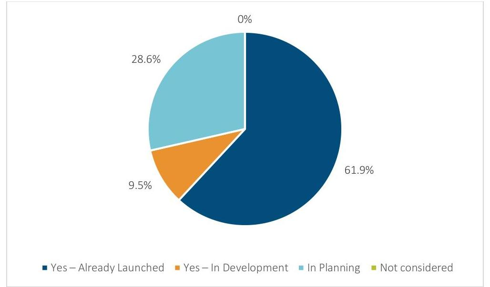

## Page 19
Figure 2
DURATION OF LLM USE AMONG CHINESE INSURERS

The results (Figure 2) show that usage is mostly very recent: $61.9 \%$ have $<1$ year of experience with LLMs, and $28.6 \%$ have $1-3$ years. Only about $9.5 \%$ claimed $>3$ years of experience, which likely means they were including earlier NLP models or that they started in 2021 with Chinese pre-GPT models. In essence, roughly two-thirds adopted LLMs in 2023. This aligns with the timeline of ChatGPT (late 2022) and the subsequent rollout of Chinese large models (mid-2023). It also suggests that most projects are in early phases or recently launched, which may temper the extent of measurable impact so far.

Next, we look at approaches to implementation. Companies can either build AI capabilities internally, partner with external tech providers, or use some combination. We asked how they are pursuing large-model projects (Q5). Results are shown in Figure 3.

Figure 3
IMPLEMENTATION APPROACHES FOR LLM PROJECTS IN INSURANCE COMPANIES
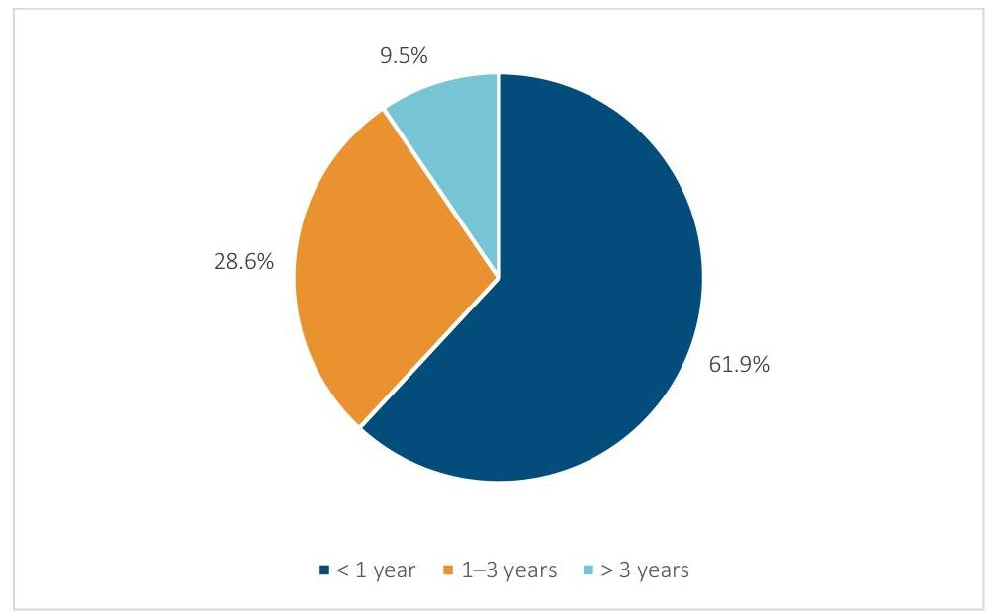
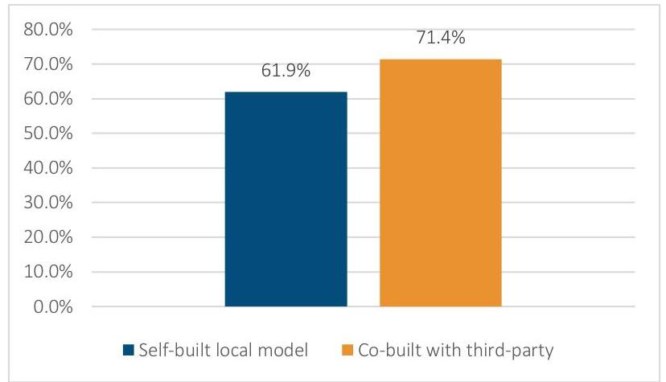

## Page 20
The dominant strategy is collaboration with technology firms: $71.4 \%$ of companies indicated they co-build with third-party service providers. Interestingly, $61.9 \%$ also indicated self-building (in-house development). These percentages sum to over 100\%, implying that many companies are doing both - e.g., developing some internal models while also integrating third-party platforms. In fact, separate analysis of responses reveals roughly three groups: about nine companies mainly co-develop with a partner, six mainly build in-house, and another six use both approaches (hybrid). This hybrid approach often means a company might use an external model for general capabilities but fine-tune or customize it in-house for their needs. The data highlights that few insurers rely solely on external "black box" solutions - even those partnering with big tech (like Alibaba or Baidu) often have their own team working closely on the project to retain knowledge and control.

Supporting this, Q7 (Figure 4) asked those co-building which tech supplier they work with.
Figure 4
TECHNOLOGY PARTNERS FOR LLM CO-DEVELOPMENT AMONG INSURERS

The top choice was Alibaba, named by $52.4 \%$ of respondents. Alibaba's Cloud has a large model platform (Qwen), which appears to be popular. Other partners included Baidu and iFlytek (19\% of companies each), Huawei (14\%), and a notable 19\% said "none" - presumably, those who did not engage a third party despite earlier selecting co-build or possibly indicating a purely internal project. A significant portion (28.6\%) selected "Others," which, upon further investigation, primarily referred to Tencent. Many insurers use Tencent's WeCom (Enterprise WeChat) as their internal communication platform, making Tencent Yuanbao's AI solutions a natural choice. The key insight is that Alibaba Cloud stands out as the leading AI partner for Chinese insurers, likely due to its cloud solution already being widely used by the insurers. Baidu's ERNIE and iFlytek's Spark are also making inroads as domestic alternatives. International models like Microsoft were cited by very few (only $4.8 \%$ mentioned Microsoft Azure/OpenAI), largely due to data compliance and accessing issues in China.
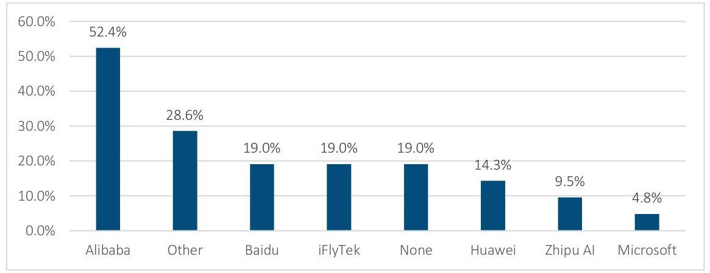

## Page 21
For organizations opting to develop their own Al solutions, we investigated the tools and models they employ (Q6). Results are summarized in Figure 5.

Figure 5
PREFERRED LLM MODELS FOR IN-HOUSE DEVELOPMENT BY INSURERS

Notably, $90.5 \%$ reported using DeepSeek as their preferred local large language model, reflecting a strong industry shift toward this open-source solution following its release in February 2025. The remaining responses, each accounting for less than $10 \%$, mentioned the use of other proprietary models. It's worth noting that, when we designed the survey, Alibaba's Qwen had not yet gained significant traction and was, therefore, not listed explicitly as an option-hence its appearance under "Other." The widespread adoption of DeepSeek suggests that Chinese insurers favor its open-source, resource-efficient architecture for internal development. This trend not only points to DeepSeek becoming the de facto industry standard but also implies potential for greater community knowledge-sharing and ecosystem growth.

We also asked about external visibility of these Al projects. Only $23.8 \%$ of companies provided a web link or said they had external publicity for their LLM project, while $76.2 \%$ selected "None" (no public-facing information). This indicates that many projects are internal or not widely advertised, which could be due to being in pilot phase or considered competitively sensitive. Those that answered "Yes" with a link likely correspond to companies that have publicly launched something (for instance, a press release about a new Al chatbot on their website). The majority keeping a low profile might also reflect caution - companies may want to validate results before making public claims. It might also reflect that some Al deployments are internal tools (not customer-facing), so there's no public webpage to show.

In summary, all surveyed insurers in China are actively engaging with large language model (LLM) technologies. Most have already launched at least one application, often collaborating with major tech providers, while simultaneously developing internal expertise. The adoption pace has been remarkably swift; notably, a majority have embraced DeepSeek within just a few months. This rapid uptake underscores the insurance industry's recognition of LLMs as critical innovations-perhaps even competitive necessitiesspurred by breakthroughs like ChatGPT in 2023.
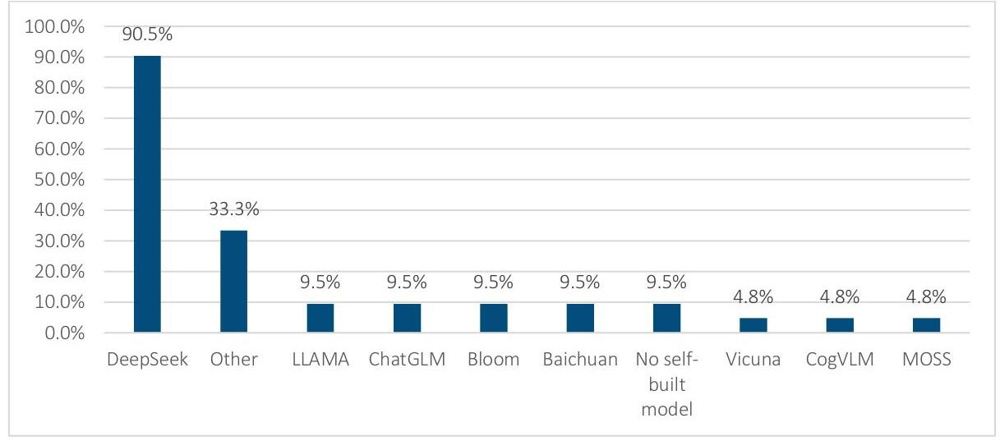

## Page 22
# 4.2.2 PRIMARY APPLICATION AREAS FOR LLMS 

We turn now to what insurers are actually doing with large models. The survey generally asked which business areas or application fields the company is focusing its LLM technology on (Q9 allowed multiple selections among key insurance functions).

Figure 6
LLM APPLICATION AREAS ACROSS INSURANCE FUNCTIONS

As shown in Figure 6, the responses show that internal company use-cases are the top priority. An overwhelming $95.2 \%$ of respondents said "internal support" is an application area for large models in their company. This was the highest of any category, indicating that nearly every insurer sees value in deploying LLMs to assist internal staff or processes (e.g., an internal chatbot that employees use to query company knowledge, or generative tools to help with report writing and coding). This aligns with a general trend in AI adoption - often companies start internally where data is internal and stakes are a bit lower, to prove value before externalizing.

The next most common areas were customer service (66.7\%) and agent (sales) support (57.1\%). These are traditional customer-facing functions where earlier AI was also applied, now being enhanced with LLM capabilities. More than half of the companies also chose underwriting services (52.4\%) and claims services (52.4\%), showing that core insurance operations are very much on the agenda for LLM deployment. Product development was selected by $23.8 \%$, making it a secondary focus, and $19 \%$ listed other niche areas. Figure 9 of the survey report visually summarizes this distribution, with Internal assistance towering at the top.

These results suggest that no single business area is being ignored - companies are finding uses for AI across the insurance value chain - but they prioritize internal and customer-facing support functions first. Internal assistance being the top response (95\%) is particularly notable. It implies that one of the first things many insurers did with LLMs was likely to create an internal "AI assistant" for employees, e.g., to answer employees' questions (about products, regulations, IT support, etc.), draft documents, or summarize reports. This resonates with moves in other industries where tools like ChatGPT have been used to enhance internal knowledge management and productivity.

To delve deeper, our survey structured specific questions for each major area. We will discuss each in turn: Customer Service, Agent/Sales Support, Product Development, Underwriting, Claims, Customer Demand Analysis/Marketing, and Internal Efficiency. For each, we cover (a) whether insurers think LLMs are applicable to that area, (b) what specific applications or forms they use, and (c) what benefits they perceive.
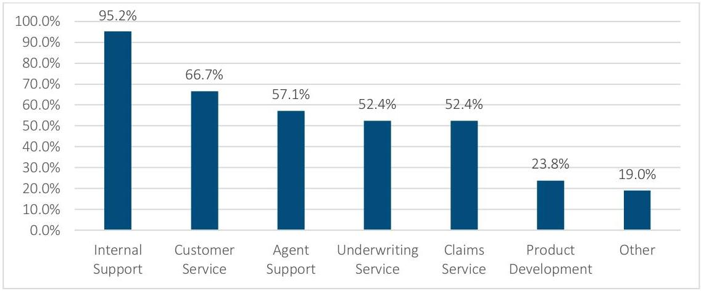

## Page 23
# 4.2.3 CUSTOMER SERVICE APPLICATIONS 

Customer service is a critical front-line area for insurers dealing with high volumes of inquiries and policy servicing requests. According to our survey, the majority of insurers believe LLMs add value here, but a notable minority remain skeptical. When asked "Do you find large models applicable in customer service?" (Q11), $76.2 \%$ answered "applicable," while $23.8 \%$ chose "not applicable." So, about three-quarters are positive about using LLMs to enhance customer service, yet roughly one in four currently feels LLMs might not be suitable or mature enough for this area. The quarter who said "not applicable" likely have concerns such as accuracy of responses or compliance (customer service often requires very accurate information and needs to avoid any miscommunication). Still, customer service shows one of the highest acceptance rates (76\%) among the scenarios (for comparison, product development and some others were lower). This is consistent with the fact that customer service Al (chatbots) was already common in the narrow Al era, so companies are naturally extending that with more advanced LLM-driven bots.

Among those using LLMs in customer service, what methods are they using? Q12 asked in what ways big models are changing customer service. The result was emphatic: $100 \%$ of respondents who consider it applicable chose "intelligent customer service" (AI chatbots/virtual assistants) as a key application. In other words, everyone agrees that the primary role of LLMs in customer service is to provide an AI chat interface for customers. This could be either text-based (chat on website/app) or voice-based (an AI voice agent on a hotline), though likely the former is easier initially. Besides chatbots, $62.5 \%$ also chose "personalized recommendations" in the customer service context. This indicates using AI to personalize the interaction for instance, if a customer is chatting about policy options, the AI might recommend riders or new products tailored to them. Only $6.3 \%$ listed "other" approaches, showing the focus is clearly on chatbots and recommendations. The unanimous 100\% for intelligent customer service underscores that chatbots are seen as the primary app for LLMs in support, likely because LLMs (like ChatGPT) dramatically improve a bot's ability to understand free-form questions and engage in dialogue, compared to earlier rule-based bots.

We also inquired about what types of LLM systems they have deployed for customer service (Q13).
Figure 7
TYPES OF LLM IMPLEMENTATIONS FOR CUSTOMER SERVICE

The responses (Figure 7) reveal that Chatbots are, by far, the most popular format - 93.8\% of companies (15 out of the 16 responding to that question) have implemented chatbots for customer service. Additionally, $87.5 \%$ have knowledge-based systems. There is some overlap in terminology: a chatbot can be considered a type of knowledge-based Q\&A if it's responding from a database of information. Likely, the question allowed multiple selections: chat-style interface, a knowledge-based search interface, or recommendation system.
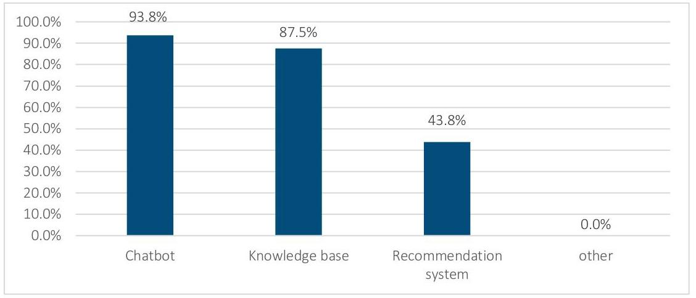

## Page 24
Indeed, $43.8 \%$ also indicated using a "recommendation system" in customer service (which ties to the personalized recommendation mention above). None selected "other" here (0\%), implying the categories given covered all current implementations. This again highlights that the two main deployments are an LLM chatbot (capable of conversationally answering questions) and an intelligent FAQ search (where the LLM can retrieve and present answers from a knowledge base like policy documents). The high uptake of knowledgebased Q\&A (87.5\%) suggests many insurers have fed their policy manuals, product info and, perhaps, past Q\&A data into an LLM or retrieval-augmented system that the bot can draw from. The presence of recommendation systems ( $43.8 \%$ ) shows some are integrating the bot with cross-sell/up-sell functions or next-step suggestions, which could be considered a more advanced use (blending customer service with marketing).

Importantly, what do insurers see as the benefits of LLM-powered customer service? Q14 asked which benefits are realized.

Figure 8
REPORTED BENEFITS OF LLM-BASED CUSTOMER SERVICE

As shown in Figure 8, the top benefit chosen was "Timeliness" (speed of service) - 93.8\% of respondents using LLMs in customer service reported significantly improved timeliness of responses. This makes sense: AI chatbots can give instant answers, whereas human service might queue customers. Next, 81.3\% highlighted improved efficiency, which often goes hand-in-hand with timeliness. Efficiency could mean handling more inquiries in parallel or reducing manpower needed. Only $37.5 \%$ chose improved accuracy as a benefit of LLM customer service This relatively low number for accuracy likely reflects caution: LLMs might occasionally give incorrect or inconsistent answers, so insurers are not yet lauding accuracy as a strength. In fact, human agents might still beat AI on accuracy for complex queries. No one marked any other benefit beyond these. So, the consensus is that speed and efficiency are the key advantages of deploying AI in customer service, whereas accuracy is still a concern. This aligns with the known trade-offs of current LLMs: they excel at fluency and availability but can occasionally err or "hallucinate." Thus, many companies likely use them with guardrails (e.g., the LLM provides an answer, but if it's not confident or if it's a critical question, it may escalate to a human).

The quarter of companies who said LLMs are not applicable to customer service likely do so exactly because of accuracy or compliance concerns - for example, if an AI gave a wrong answer about coverage, it could cause customer disputes or even regulatory issues. Those companies might be waiting for further model improvement or restricting AI to internal support for human agents (rather than directly chatting with customers).

## Page 25
From the academic perspective, it's worth noting that intelligent customer service is one of the most developed InsurTech areas in China, with even pre-ChatGPT bots in widespread use. The survey indicates LLMs have supercharged this capability where adopted by enabling more natural and complex dialogues. For example, a generative AI can handle multi-turn conversations about policy features or assist customers in filling out forms interactively, which older bots struggled with. The improved timeliness (instant answers any time) and efficiency (one AI serving many customers simultaneously) directly translate to better customer satisfaction and lower operating costs.

In conclusion for customer service: most Chinese insurers are leveraging LLMs to enhance their customer support, primarily via chatbots. These AI agents deliver much faster service and handle large volumes, though companies remain mindful of their limitations in accuracy. We can expect continuous refinement in this area, possibly blending human review for sensitive inquiries to get the best of both worlds.

# 4.2.4 AGENT AND SALES SUPPORT 

Insurance sales in much of Asia still rely heavily on human agents and advisors. Augmenting these agents with Al is a key opportunity - often referred to as "agent enablement." Our survey's section on Agent Support (Q15-Q17) reveals strong enthusiasm for using LLMs to empower sales agents and improve sales processes.

First, similar to customer service, we asked if respondents find LLMs applicable to the agent support scenario (Q15). The response was even more positive: $90.5 \%$ said "applicable," and only $9.5 \%$ said "not applicable." In raw terms, 19 out of 21 insurers see a role for Al in supporting their sales force, with just two expressing skepticism. This was one of the highest endorsement rates among all the domains surveyed. It likely reflects that agents constantly need information and materials - tasks well-suited for Al assistance. Additionally, many insurers face challenges like large agent teams with varying skill levels, and Al could help reduce the performance gap by giving every agent a smart assistant.

What forms does this support take? Q16 inquired about what forms of agent support via large models are being used.

Figure 9
LLM-SUPPORTED FUNCTIONS FOR INSURANCE AGENT ENABLEMENT

As shown in Figure 9, the most popular form was "marketing content generation," selected by $89.5 \%$ of applicable respondents. This suggests that an immediate use of LLMs is to automatically create or customize sales materials - for instance, drafting product brochures, presentations, social media posts, or client emails for agents. Instead of agents composing things from scratch, an AI can draft content that the agent then fine-
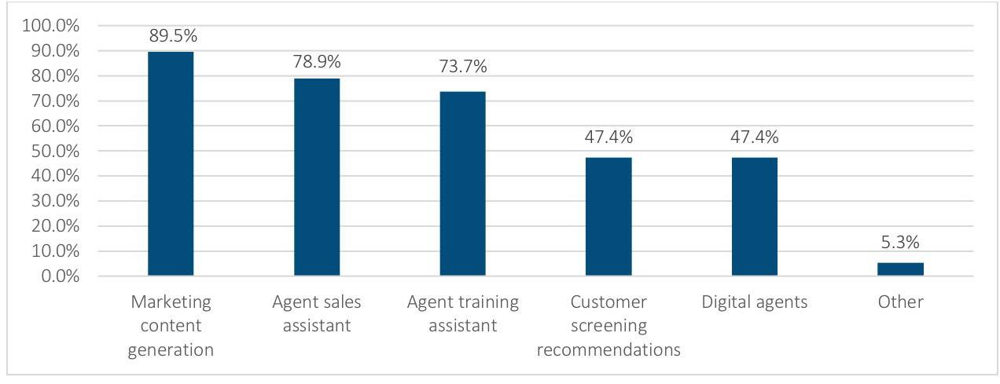

## Page 26
tunes. The next most common was "agent sales assistant," at $78.9 \%$. This likely refers to an interactive assistant (maybe a mobile app or chatbot interface) that an agent can consult in real time.

Similarly, $73.7 \%$ chose "agent training assistant," indicating the use of Al to help train or onboard. Around half of respondents also use LLMs for "customer screening recommendations" (47.4\%) and "digital agents" (47.4\%). "Customer screening recommendations" implies Al analyzes potential leads or existing client data to recommend which customers to approach and with what products - essentially augmenting prospecting. "Digital agents" might mean a fully virtual agent that sells insurance (an Al sales bot that could interact with customers directly, which is an ambitious use). The moderate uptake (47.4\%) suggests some companies are experimenting with such direct Al sales, but it's not yet ubiquitous or, perhaps, those projects are in pilot phases. One respondent (5.3\%) selected "Other," specifying "Product Proposal" as their Al use case.

One intriguing detail: the summary text for Q16 noted "Marketing content generation" is the most popular form of support, which fits with the data (89.5\%). This shows generative Al's strength in content creation is being put to use - insurance involves a lot of paperwork and explanation, so automating that content helps agents spend more time selling and less time writing.

Figure 10
PERCEIVED BENEFITS OF LLM-BASED SUPPORT FOR INSURANCE AGENTS

As for perceived benefits in agent support (Q17), the survey found that speed and efficiency are, again, the top choices. Both "timeliness" and "efficiency" were selected by $78.9 \%$ of respondents, tying as the highestrated benefits. Agents value quick responses - e.g., getting information or materials instantly - and improved efficiency - e.g., handling more clients at the same time with Al help. The next benefit was "comprehensive" at $73.7 \%$. This suggests Al support tools are appreciated for providing more thorough information coverage than an agent might recall on their own. For example, an Al can draw on the entire knowledge base of the company, so it can give more complete answers to unusual client questions, thereby augmenting the agent's knowledge scope. "Assists agent decision-making" was noted by $63.2 \%$. This means agents believe Al helps them make better decisions (like which product to pitch, or how to prioritize leads). About $47.4 \%$ mentioned improved accuracy in their work - for instance, ensuring the information they give clients is correct. Overall, faster service to clients and higher agent productivity are seen as the main gains, with a nice side effect that agents have a more complete and correct set of information to work with.
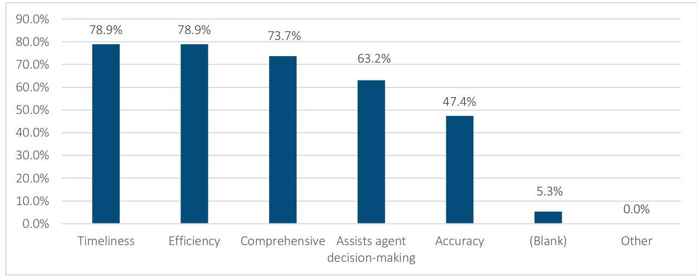

## Page 27
It is worth connecting this to the findings from our academic survey: many universities reported that they are introducing data analysis and machine learning into actuarial curricula, which means future agents (or rather, future actuarial and technical staff) will be more data/AI-savvy. However, agent training in soft skills and product knowledge could also be transformed by AI - indeed, $74 \%$ using AI for training assistance suggests new hires can practice with AI or learn at their own pace with AI tutors.

Real-world example: Sunshine Insurance's 2023 article (discussed later) specifically envisions large models evolving from assisting agents to eventually taking a leading role in sales. Our survey confirms that companies are currently in the "assist and empower" phase - agents are augmented by AI for better service. All signs point to productivity boosts: agents armed with instant info, auto-generated pitch decks, and insight into customer needs.

In summary, insurers are enthusiastically deploying LLM solutions to support their sales agents. Common tools include content generators to create polished brochures or social media posts, Al assistants that answer agents' questions or help them train, and analytic tools to identify sales opportunities. The benefits are clear in speed, efficiency, and breadth of knowledge, which can translate to more sales and better client advisory. This domain shows Al and humans working in tandem - Al handling data and paperwork, humans building relationships - a model likely to persist.

# 4.2.5 PRODUCT DEVELOPMENT 

The product development process in insurance - which involves designing new insurance products, pricing them, and filing them with regulators - is another area seeing early Al exploration. This is a more technical domain, often led by actuaries and product managers, and not as immediately customer-facing as service or sales. The survey responses indicate a mix of optimism and caution here, with product development having one of the higher "not applicable" responses among scenarios.

In Q18, we asked if large models are applicable to product development. $57.1 \%$ said "applicable," while $42.9 \%$ said "not applicable." This nearly 60/40 split shows a more tempered view compared to customer service or agent support. It suggests that, while a majority see potential for Al in product R\&D, a significant minority currently do not think LLMs fit well into product design/pricing tasks. The reasons could be various: product development is complex, requiring compliance and creativity within regulatory bounds, and much of it is actuarial analysis, which is quantitative (something LLMs aren't directly designed for). Also, it might be that companies haven't yet tried Al in this area, focusing first on service and support functions.

Despite the mixed applicability perception, those who do apply AI to product development see notable advantages. Q19 (Figure 11) asked how big models change product development.

## Page 28
Figure 11
REPORTED IMPACTS OF LLMS ON INSURANCE PRODUCT DEVELOPMENT

The top selection was "faster development cycles," chosen by $83.3 \%$ of applicable respondents. Indeed, ten of 12 companies (since 12 said applicable, presumably 12 answered Q19) believe Al can shorten the time needed to create or update products. This could be through automation of research (like scanning market data or competitor filings quickly) or generating draft policy wordings and documentation for new products, tasks which LLMs can assist with. The next was "assisting market analysis" at $66.7 \%$. This implies LLMs are being used to analyze customer needs or trends to inform product ideas - for example, scanning social media or agent feedback for gaps in coverage that a new product could fill. "More accurate analysis" was at 50\%, which likely refers to data analysis or forecasting accuracy improvements (perhaps using Al to analyze historical data better). No one claimed other major changes, though $8.3 \%$ had a blank(null) entry.

So, the big promise in product development is speed. This resonates with insurance executives' constant push to reduce the time-to-market for new products, which can be many months traditionally. If Al can cut that by helping gather information, generate drafts, or quickly iterate on pricing assumptions, it's a huge win. The results suggest that many respondents indeed anticipate substantial time savings.

Q20 (results shown in Figure 12) asked about the benefits of large-model use in product development.
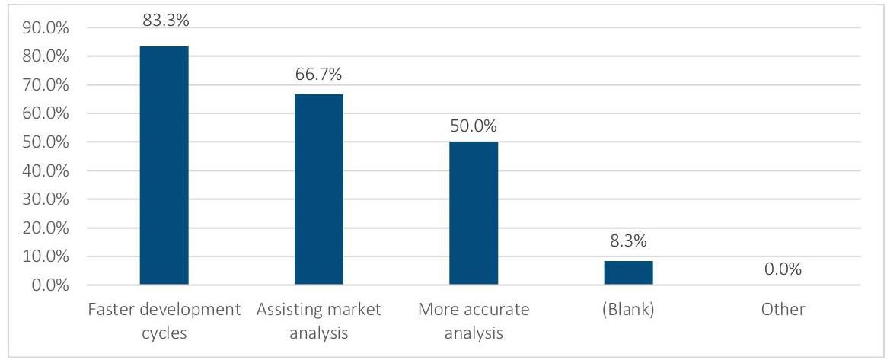

## Page 29
Figure 12
PERCEIVED BENEFITS OF LLMS IN INSURANCE PRODUCT DEVELOPMENT

The most cited benefit was improved efficiency, at $91.7 \%$. This aligns perfectly with the faster cycle point efficiency meaning the team can do more in less time. Other benefits included "comprehensive" (66.7\%), likely meaning Al ensures they consider a wider range of data or scenarios when designing products, and "cost savings" (58.3\%), perhaps because a faster development process uses fewer resources or because Al might reduce the need for external research consultancy. Accuracy was selected by $50 \%$ here, indicating some feel Al can reduce errors or improve the precision of pricing. A small number (8.3\%) put other or had blank (null) entries, meaning maybe one respondent had a unique benefit noted.

From the academic survey perspective, it's worth noting that some academic respondents were focusing research on risk models and algorithms, which ties to product pricing. However, insurance product development is heavily regulated, and any Al that impacts pricing or terms would need rigorous validation. At this stage, it's likely LLMs are used more for supportive tasks in product development, brainstorming ideas from text data, drafting texts, and summarizing competitor products, rather than the core actuarial calculations, which are numeric and require different Al techniques.

Overall, the survey signals cautious adoption of Al in product development - with a majority seeing the value in speeding up work and tapping more data, but a substantial minority unconvinced so far. As models improve and more tools emerge (like GPT-4 being able to handle some quantitative reasoning or specialized models for actuarial calculations), this area may grow. For now, efficiency gains are the main story for those using LLMs in product development, while concerns about accuracy and compliance likely make others hold back.

# 4.2.6 UNDERWRITING SERVICES 

Underwriting is the process of evaluating risks and deciding whether to insure and at what price/terms. It often involves both automated checks and human judgment, especially for complex cases. Our survey section on underwriting (Q21-Q23) indicates that insurers largely believe LLMs can help here, particularly by automating routine underwriting and supporting decision-making, though some remain cautious.

In Q21, 71.4\% of respondents said large models are applicable to underwriting services, versus 28.6\% indicating not applicable. A solid majority sees a role for Al in underwriting, but a notable minority (six out of
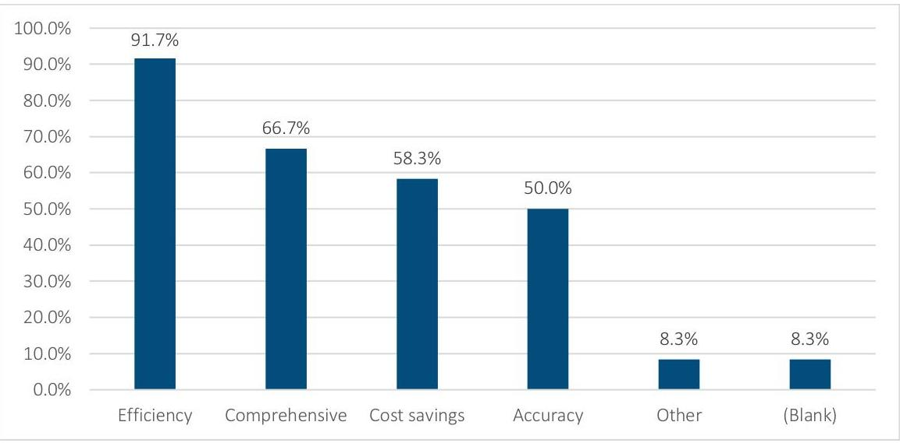

## Page 30
21 companies) do not yet. This is similar to customer service's acceptance rate. Underwriting involves a lot of text (applications, medical reports, financial statements), which LLMs can analyze, but also requires accurate judgments which, if wrong, can either expose the company to too much risk or drive away good customers. Those who answered "not applicable" likely worry about trusting AI with risk decisions or compliance issues, or maybe their line of business is such that underwriting is highly technical.

For the 15 companies or so who see it as applicable, Q22 asked how large models change underwriting.
Figure 13
LLM APPLICATIONS IN INSURANCE UNDERWRITING

As can be seen in Figure 13, two particular applications stood out: "automated underwriting" and "assisting underwriting decisions," both selected by $80 \%$ of respondents. Automated underwriting means using AI to automatically process straightforward cases. For example, an AI might read a life insurance application and medical exam report and decide whether it fits standard approval criteria. Assisting in conclusion determination means for cases that still need human underwriters, the AI can provide a recommendation or risk assessment to help the underwriter make the final decision. The equally high selection of these two (each $80 \%$ ) indicates a dual strategy: many insurers want to fully automate simple cases and assist underwriters on complex cases. Meanwhile, $66.7 \%$ also indicated "interactive pre-underwriting." This suggests an AI might interact with customers or agents during the application process to gather information or do an initial risk triage before formal underwriting. For instance, a chatbot might ask follow-up questions on an application or do a preliminary eligibility check. A small $6.7 \%$ had a null/other response, which might be a minor note or unique use case.

So, the picture is: Insurers plan to use LLMs to speed up underwriting decisions and make them more consistent. Automated underwriting can cut down turnaround time drastically (from days to instant approval for simple policies), and Al assistance can ensure human underwriters don't miss key points and calibrate decisions with more data.

The benefits (Q23) further emphasize efficiency. Results are shown in Figure 14.
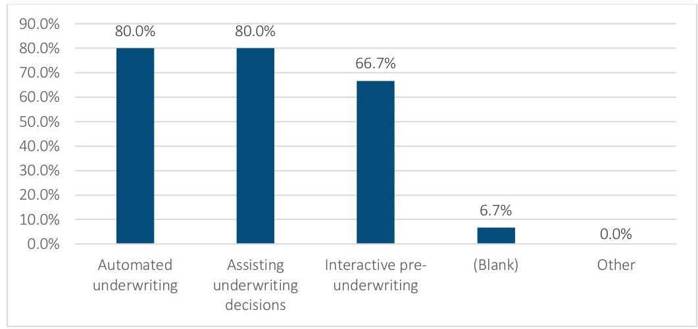

## Page 31
Figure 14
PERCEIVED BENEFITS OF LLMS IN UNDERWRITING PROCESSES

A strong $86.7 \%$ said a benefit is improved efficiency in underwriting. Also, $80 \%$ cited cost savings and "Assisting underwriters" (i.e., helping underwriters). These three top items form what the survey report called the "core advantage perception" for Al in underwriting. They reflect that by automating a chunk of the underwriting work, insurers save on operational costs (fewer manual hours per application) and allow underwriters to focus on tricky cases - effectively, the Al becomes a team member handling the grunt work. Sixty percent also chose improved accuracy, meaning some believe Al can reduce underwriting errors or inconsistencies. This is plausible: Al underwrites the same way every time given the same data, whereas humans might have variable judgments. Plus, Al can check more data points (like cross-referencing databases) quickly, potentially catching risk indicators a human might overlook. A small fraction (6.7\%) left it blank.

Compared to product development, underwriting has a higher level of acceptance and slightly different emphasis (cost and assisting underwriters are key, whereas product development is more about speed and efficiency). Underwriting is a live operational process with direct financial impact, so efficiency and cost are tangible, whereas product development is project-based.

One interesting note: some big Chinese insurers have already developed Al underwriting engines (for example, Ping An's life insurance uses an Al underwriting rules engine for standard cases). These are often rule-based though; LLMs could add the ability to interpret unstructured data (like medical report text) that doesn't fit neatly into checkboxes. For instance, reading a doctor's notes to identify medical conditions that matter for risk is something an LLM fine-tuned on medical text could do.

The $28.6 \%$ who said "not applicable" are likely demonstrating concern that trusting Al with risk selection is risky (pun unintended). If the model isn't perfect, it could approve bad risks or deny good ones, hurting loss ratios or customer experience. Regulation is also relevant: in some jurisdictions, automated underwriting decisions require transparency and, if an Al can't explain its rationale (the black box issue), that could be problematic. Thus, companies may proceed carefully, using Al as a recommender but keeping humans in the loop for final sign-off, at least initially.

Overall, the survey suggests broad interest in using Al to streamline underwriting - automating what can be automated and giving underwriters better tools for what remains. Efficiency, consistency, and costeffectiveness are the driving benefits. Given underwriting is essentially decision-making under uncertainty,
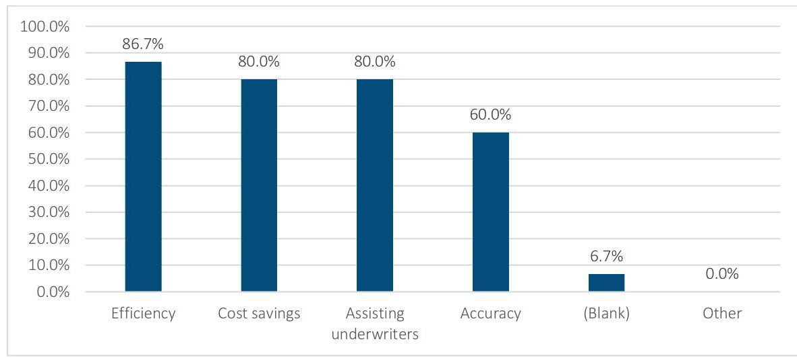

## Page 32
LLMs and AI can crunch more data to reduce that uncertainty. Combined with big data (like telematics for auto, health data for life) and predictive analytics, LLMs could form one part of a next-generation underwriting platform. Our findings indicate Chinese insurers are actively working on this, with many early implementations focusing on automating simpler tasks and providing decision support.

# 4.2.7 CLAIMS SERVICES 

The claims process - assessing losses and paying out benefits - is another crucial area where Al can have a direct impact on cost and customer satisfaction. Our survey results for claims (Q24-Q27) show that insurers largely agree on using Al to make claims handling faster and more efficient. Similar to underwriting, there is high interest in automation and supporting claims adjusters.

Firstly, Q24 asked if LLMs are applicable to claims services. $76.2 \%$ said applicable, $23.8 \%$ said not applicable. This is very close to the customer service scenario's proportions. It indicates most insurers see clear use cases in claims, though about a quarter still have reservations. Claims can be quite complex (especially injury or liability claims), so those with reservations might worry about Al's judgment on claims fairness or its ability to interpret diverse evidence correctly. Still, over three-quarters responding positively shows strong momentum.

What are they doing in claims? Q25 asked how big models can change claims services. Results are summarized in Figure 15.

Figure 15
LLM USE CASES IN CLAIMS PROCESSING

Two use-cases tied as the top choices: "automated processing" and "rapid review," each at 87.5\%. Automated processing likely refers to straight-through processing of simple claims (for example, an auto claim below a certain value with clear documentation could be automatically processed and paid by an AI without human involvement). Rapid review refers to using Al to drastically speed up the review of claims documents. An example is using computer vision and NLP to review medical invoices or accident descriptions rapidly. The next option, "assisting claims decisions," was chosen by $68.8 \%$. So, similar to underwriting, many are also employing Al as decision support for more complex claims - e.g., an AI might suggest a settlement amount or flag inconsistencies for human adjusters to consider. A small $6.3 \%$ indicated other or had no answer. The emphasis is clear: automation and speed in claims are seen as the prime applications of LLM/AI, with decision support being secondary.

Q26 (results summarized in Figure 16) then asked about types of large model used in claims.

## Page 33
Figure 16
TYPES OF AI MODELS USED IN CLAIMS PROCESSING

The results show a bit of variety: $81.3 \%$ use a "claims decision recommendation" model, $68.8 \%$ use image recognition, and $56.3 \%$ use data mining in claims. "Claims decision recommendation" aligns with the above notion of Al suggesting outcomes (approve/deny or how much to pay). It was the highest, indicating many companies have some Al model that can analyze a claim and propose a resolution. Image recognition at 69\% shows many use Al to analyze images - typical for auto damage assessment or claim receipt extraction. "Data mining" at $56.3 \%$ might mean using Al on historical claims data to detect fraud or identify patterns. Zero percent said "other," and $6.3 \%$ left it blank.

These results confirm that multi-modal Al (text + images) is being applied in claims: images for damage and text models for description and context. LLMs can read textual claim narratives, while computer vision, which might be considered part of Al but not an LLM, handles photos. Many insurers likely integrate both.
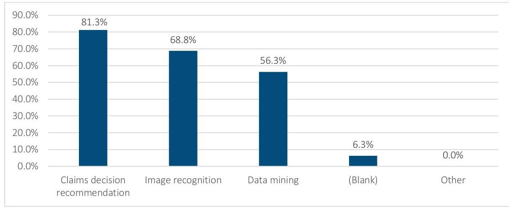

## Page 34
Benefits (Q27) for claims echoed earlier patterns.
Figure 17
REPORTED BENEFITS OF LLMS IN CLAIMS PROCESSING

As shown in Figure 17, 87.5\% cited timeliness and 87.5\% efficiency as the top benefits. These two tied for top choice, reflecting the value of quick settlement and streamlined operations. In claims processing, speed is crucial: fast settlements improve customer satisfaction and reduce costs (like car rental days, medical complications, etc.). Efficiency likewise means handling more claims with fewer adjusters or handling existing volume faster. Seventy-five percent also chose "claims assistant" as a benefit, which likely means the AI serves as a claims assistant to humans, making their job easier - consistent with the idea of augmented adjusters. Accuracy was noted by $56.3 \%$, indicating just over half feel AI improves accuracy in claims. The somewhat lower emphasis on accuracy might reflect that speed is taking priority, or that some are cautious about AI's accuracy in complex cases. A small $6.3 \%$ left it blank.

Combining these points, the consensus is that AI makes claims faster and more efficient. This has huge implications because claim costs and customer satisfaction directly impact the bottom line and brand. A faster claim settlement can even be a selling point for insurance products ("we pay claims in minutes"). Our data shows insurers are actively pursuing that via LLMs and related AI.

It's worth noting how the survey's claims findings mirror what companies like Ping An and ZhongAn have reported: Ping An's AI claims system improved first-time pass rates and sped up processing, and ZhongAn touts AI making claims "faster and more convenient." Insurers also mention AI in fraud detection, which indirectly benefits claims by avoiding bogus payouts. While fraud wasn't explicitly polled in our survey, presumably it falls under "data mining" or "other" in claims AI usage. The presence of data mining (56\%) suggests more than half are using AI to analyze claim data for anomalies (fraud patterns, subrogation opportunities, etc.).

Both underwriting and claims show similar priorities - speed and cost. Underwriting is about efficient risk selection; claims are about efficient payouts. Both have a subset who don't trust AI fully yet ( $25 \%$ said not applicable). But overall, these core insurance operations are being transformed by AI automation. The industry seems to be focusing on automating simpler decisions in both underwriting and claims, and assisting complex ones, thereby addressing both efficiency and maintaining human oversight where needed.

# 4.2.8 CUSTOMER DEMAND ANALYSIS AND MARKETING 

The survey also addressed customer demand analysis, which relates to understanding customer needs and preferences - essentially the marketing and product strategy aspect. Insurers increasingly want to use AI to
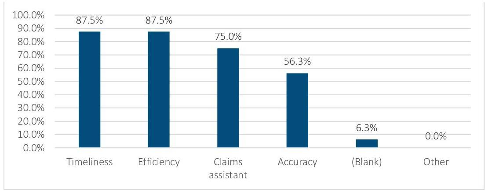

## Page 35
parse customer data and feedback to tailor their offerings and marketing strategies. Our survey (Q28-Q30) looked at whether insurers think LLMs can help in this area and how.

In Q28, 66.7\% said LLMs are applicable to customer demand analysis, $23.8 \%$ said not applicable, and $9.5 \%$ gave no clear answer (null). So, about two-thirds see AI as useful for demand analysis. This scenario had the highest skip rate in that sense, implying customer demand analysis with AI might be a newer concept that not all have engaged with, unlike the more operational areas.

For those who find it applicable, we asked (Q29, results shown in Figure 18) what tools/techniques they use for customer demand analysis.

Figure 18
TECHNIQUES USED FOR CUSTOMER DEMAND ANALYSIS

The results suggest that, currently, "big data analysis" is the main approach, used by $75 \%$ of respondents, whereas "sentiment analysis" is used by $43.8 \%$. Classic big data techniques (statistical analysis of customer data, segmentation, etc.) dominate customer insight work. Sentiment analysis - presumably mining social media or customer reviews to gauge sentiment - is a secondary but notable technique (almost half use it). Large language models could enhance sentiment analysis by better understanding the nuances in customer comments. This question might have been more about general practice than specifically LLMs - basically establishing the current state: big data analytics is mainstream in understanding customers; sentiment mining is upcoming.
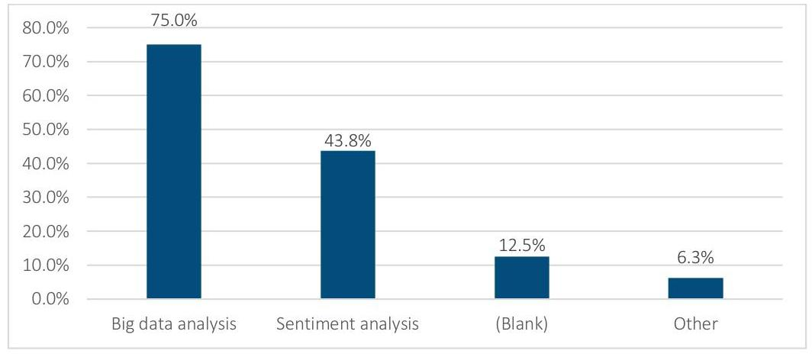

## Page 36
Q30 then asked how large models could improve understanding customer needs. Results can be seen in Figure 19.

Figure 19
PERCEIVED WAYS LLMS ENHANCE UNDERSTANDING CUSTOMER NEEDS

Here, the top item was "precision marketing," chosen by $81.3 \%$. Precision marketing means highly targeted, personalized marketing strategies (right product to the right customer at right time), presumably using Al to analyze data and craft messages. The second was "trend prediction" at $68.8 \%$. That is using Al to predict market trends or emerging customer demands (for example, detecting that younger customers want more investment-linked insurance, etc.). Only $12.5 \%$ had other answers or left it blank. The survey text notes that precision marketing is seen as the core means to improve understanding customer needs, which is significantly higher than other options. This aligns with what the ZhongAn white paper executive summary predicted: in the mid-to-long term, personalized marketing will become a core differentiator, and insurers are actively planning for it.

So, in summary for this part, most insurers plan to use Al to better analyze and predict customer needs, primarily via precision marketing techniques. The current state relies on big data analytics (transaction data, demographics) and sentiment analysis to gauge customer preferences. LLMs can enhance that by analyzing unstructured customer feedback or engaging in conversational surveys, etc. The relatively lower clarity in this section suggests it's still a developing application of Al: companies know it's important ( $67 \%$ said applicable) but might not have fully realized it yet. Precision marketing being the top response shows the end goal - use Al to tailor products and communications individually, which requires understanding each customer's needs (something Al can infer from data far better than traditional segmentation perhaps).

Interestingly, the academic survey indicated many academics see "exploring new fields" and "interdisciplinary collaboration" as opportunities. Customer analytics could be one such field where Al, marketing, and actuarial science intersect. And, indeed, academics noted efficiency gains and new research directions through Al, which could include marketing analytics improvements.

One can connect this to how insurers in China increasingly use platforms (like WeChat) to engage customers - LLMs could analyze those chat interactions to identify unmet needs or upsell opportunities. Possibly the $12.5 \%$ who did not confirm applicability are those who haven't tapped these data sources yet or rely on agents to know customer needs.

Overall, customer demand analysis and precision marketing stand as an emerging frontier for LLM use in insurance. The survey shows general agreement on its importance, but likely the concrete implementations are still evolving. We'll see in the next section how some companies (via white papers) are approaching it.
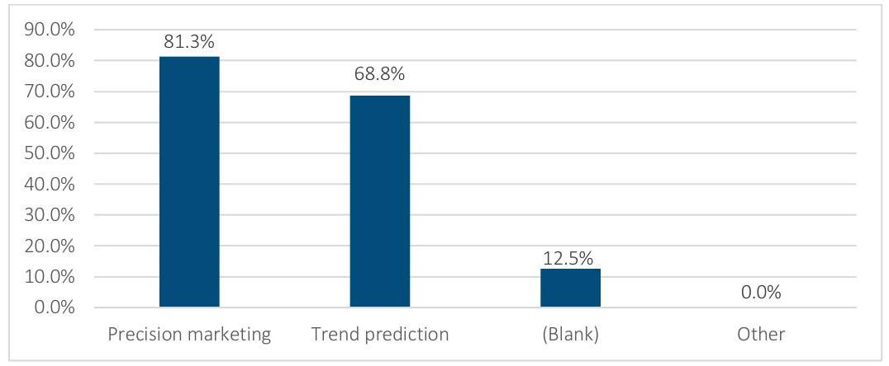

## Page 37
# 4.2.9 INTERNAL EFFICIENCY AND KNOWLEDGE MANAGEMENT 

The final scenario covered was internal efficiency improvement (Q31-Q33). Essentially, uses of AI for internal operations, knowledge management, and office productivity were not covered in prior categories. This area, as it was earlier noted, received the highest interest in Q9 ( $95 \%$ recognized it as important), so these questions gave more detail on what exactly companies are doing internally with LLMs.

Q31 asked if internal efficiency measures with LLMs are applicable: $90.5 \%$ said yes. Only $4.8 \%$ said no (1 respondent) and another $4.8 \%$ didn't respond/unclear. This means virtually all insurers see a place for AI in improving internal workflows. This extremely high approval rate is understandable - internal tools don't face customer or regulatory scrutiny, so companies can experiment freely, and any efficiency gain directly cuts costs or improves employee productivity.

Q32 (results in Figure 20) offered multiple possible uses.
Figure 20
INTERNAL USE CASES OF LLMS FOR EMPLOYEE SUPPORT

Two functions tied at the top: "Employee Q\&A assistant" and "Office assistance," each at 90\%. A Q\&A assistant likely means an internal chatbot where employees can ask questions - basically an AI helpdesk tapping into company knowledge bases. An office assistant could entail drafting emails, scheduling, summarizing meeting notes, translating documents, etc. Indeed, these two categories cover the broad concept of an "AI coworker" that helps staff with routine queries and chores.

Next, $80 \%$ said they use AI for content generation internally. This refers to generating documents, reports, presentations, or content for internal use. Seventy-five percent indicated programming assistance, meaning IT or actuarial departments are using AI coding tools to help write and debug software.

These results paint the picture that insurers are heavily leveraging LLMs internally as an "omniscient assistant" to employees across departments. From answering HR or policy questions to helping write or code, LLMs are being embedded in daily workflows. This resonates with global trends where enterprises deploy internal chatbots trained on company data (like internal wikis, manuals, etc.) and use GPT-based tools in MS Office or software IDEs to reduce drudgery. It's saying that knowledge Q\&A and office help both received a $90 \%$ response rate - clearly the low-hanging fruit of value. Employees waste a lot of time searching for info or doing routine paperwork, and LLMs can cut that significantly.

Finally, Q33 (results in Figure 21) asked about the benefits of using LLMs for internal efficiency.
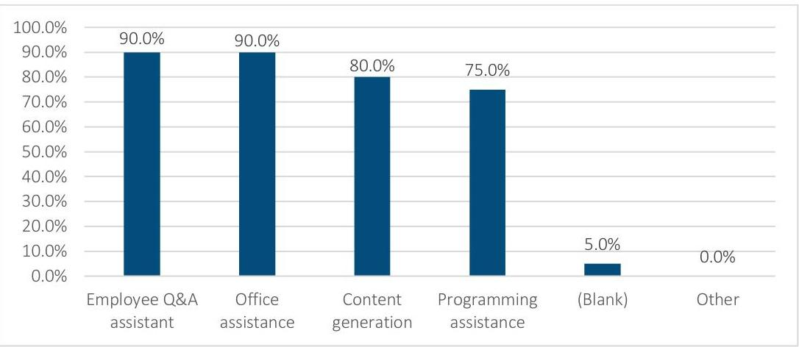

## Page 38
Figure 21
PERCEIVED BENEFITS OF LLMS FOR INTERNAL EFFICIENCY

As expected, 95\% said "efficiency" improvement is a core benefit. Following that, 85\% said "timeliness" (quick responses), and around 60\% said improved accuracy. From the summary, efficiency far exceeds other options, showing direct workflow optimization is the main observed gain. Timeliness and accuracy are secondary but still significant.

An interesting dimension: the academic survey indicated that one opportunity seen by 10 of 18 institutions was efficiency gains in research/teaching through AI. That mirrors what the industry is seeing internally - AI making internal knowledge work more efficient. Also, academics cited lack of data and software/hardware setup as challenges, which companies might also face internally to some degree (getting all internal documents in shape for AI, ensuring secure deployment, etc., though our survey captured challenges more broadly under Q34).

In summary, internal use of LLMs is nearly universal and immediately rewarding for insurers, according to our sample. They have deployed AI assistants for employees, yielding major efficiency improvements. Because these applications don't face external customers or regulatory risk, companies seem very comfortable embracing them. This internal adoption likely also builds AI familiarity and trust within the organization, which can catalyze further AI projects in customer-facing areas. It's a smart strategy: start internally (as many did), get quick wins, and then extend outward.
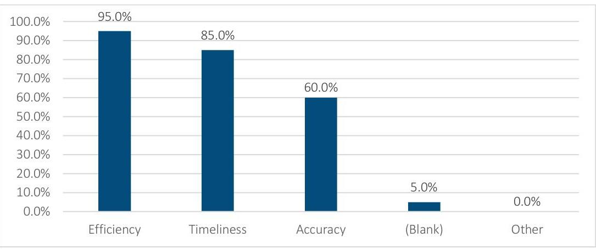

## Page 39
# 4.2.10 CHALLENGES AND SATISFACTION 

Having covered all the functional areas, our survey concluded with questions on the overarching challenges to implementing LLMs and overall satisfaction with the technology (Q34 and Q35), plus an open-ended comments query (Q36).

First, survey results regarding challenges (Q34) are collected in Figure 22.
Figure 22
CHALLENGES FACED IN IMPLEMENTING LLM APPLICATIONS

We presented a list of potential challenges and asked respondents to select those they consider as major issues in developing large model applications. Three challenges stood out well above the others:

1. Data Privacy: chosen by $81 \%$ of respondents.
2. Security: chosen by $76.2 \%$.
3. Cost: chosen by $76.2 \%$.

These were clearly the top tier, each selected by roughly 16-17 of the 21 companies. The survey analysis notes this forms the "core issues of the first tier" of challenges. It aligns with common concerns:

1. Data Privacy: Insurers deal with sensitive personal data (health info, financial details). Using LLMs, especially if cloud-based or third-party, raises concerns about protecting this data and complying with regulations (e.g., China's Personal Information Protection Law). Also, training models on company data risks exposing that data if not handled properly, so nearly all are worried about data leakage or misuse.
2. Security: This can refer to model security (preventing adversarial inputs, ensuring reliable outputs) and, more generally, cybersecurity of Al systems. Also, related to privacy, ensuring Al doesn't open new vulnerabilities. In context, $76 \%$ indicated most see security as a serious consideration - you don't want an Al that could be tricked into giving out confidential info or one that might be manipulated by malicious queries.
3. Cost: Developing and running large models is expensive - it requires significant computational resources (GPUs), possibly licensing fees, and specialized talent. Seventy-six percent acknowledged
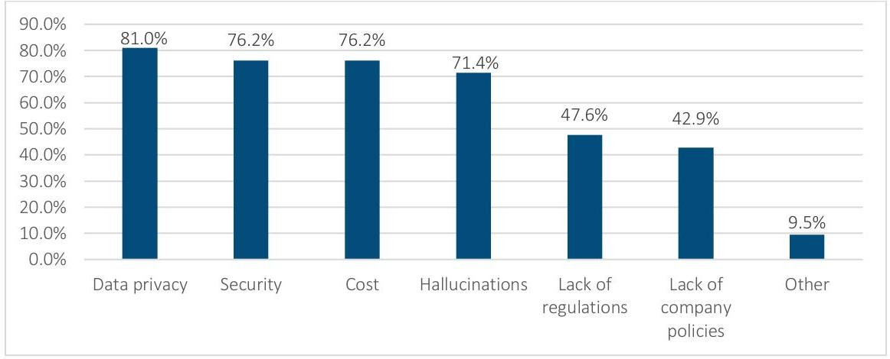

## Page 40
that cost means many have felt the financial weight of these projects. This includes not just training costs, but also inference costs if models are used at scale, and the cost of data preparation.

The next tier of challenges included:

1. Hallucinations (model output not reliable) - about $71.4 \%$ selected this. This indicates a large concern that LLMs sometimes generate incorrect or fabricated information (commonly known as hallucinations). It's a well-known problem with GPT-like models and, in insurance, incorrect info can be harmful. So, managing and mitigating hallucinations (perhaps via better training or human validation) is on many minds.
2. Lack of regulations $-47.6 \%$. Nearly half felt the regulatory environment is not yet fully supportive or clear on AI use. However, with China's government issuing interim AI rules in 2023, and likely more to come, this might improve. Still, at the time of this survey, regulation was playing catch-up.
3. Lack of company policies $-42.9 \%$. This means internal policies, governance frameworks, or IT systems are not fully in place to support AI projects.
4. Other $-9.5 \%$ : a couple of respondents had other challenges; high cost was mentioned.

These challenge rankings make sense. They emphasize that the main barriers are not the lack of ideas or unwillingness - it's practical issues: protecting data, ensuring security, controlling costs, and dealing with model limitations like hallucinations. Internal and external governance frameworks are still catching up.

Our academic survey also found similar things: top challenges for academia were data access (8 of 18) and setup (8) and, for insurers, data privacy is essentially about data, and cost is akin to funding, which academics also mentioned (4). Also, academics noted faculty expertise (7 of 18) as a challenge, which in companies probably translates to talent shortage (not explicitly in our list but likely a pain point as well). It's possible "the company lacks relevant systems" in our survey was a euphemism encompassing the lack of skilled personnel or processes, chosen by $42.9 \%$.

## Page 41
Next, survey results regarding satisfaction (Q35) are shown in Figure 23. In this question, we asked respondents to rate their satisfaction with their company's large-model applications so far.

Figure 23
SATISFACTION WITH LLM IMPLEMENTATION OUTCOMES

The results are quite positive. A majority (57.1\%) chose "satisfied," and 19\% chose "very satisfied." So, about $76 \%$ are satisfied to some degree. Nineteen percent said "average(neutral)," and only $4.8 \%$ (one respondent) said "dissatisfied." None selected "no opinion" (0\%). This indicates a high overall satisfaction - no one is outright unhappy beyond one isolated case, and more than three-quarters are pleased. The survey summary notes that more than half being satisfied reflects a high overall satisfaction rate and that this is the main tendency. The presence of $19 \%$ very satisfied early adopters is encouraging. This general happiness likely stems from the efficiency gains and successful deployments described earlier. It suggests that, despite challenges, the projects undertaken have yielded enough benefits that respondents view them favorably.

It's also possible there's a bit of bias - those who responded are presumably the ones involved in making these projects happen, so they would want to report success. But since it was anonymous, presumably they were candid. The lack of "very dissatisfied" is notable; perhaps any major failures or disappointments haven't occurred, or those companies didn't respond to the survey.

Open comments (Q36): The survey provided an open-ended comment section on using large models. While individual responses are not listed here, the general themes can be summarized as follows: respondents generally acknowledged that, while LLM technology has huge potential, it is still in an early stage of development - products are not fully mature, and issues like stability and cost remain key challenges. There is recognition that general-purpose models lack some specialized industry knowledge, hence a need for vertical domain models. Many mentioned that, in current scenarios, LLMs can improve efficiency by 70-80\% as an assistive tool, but their accuracy/reliability isn't sufficient to operate without human oversight. There were also notes on implementation bottlenecks beyond technology - for example, the need for organizational change, breaking silos between business and tech departments, and fostering a willingness among staff to use these tools. Finally, they expressed optimism about the technology's potential but noted that some applications are still superficial and need deeper integration and iterative improvement to truly transform business value.

These qualitative insights, compiled from Q36 responses, complement the quantitative data. They highlight that cultural and organizational adaptation is as important as the tech itself. Also, they hint at an interesting figure: "improve efficiency by about $80 \%$ as auxiliary tools" - which suggests that, in scenarios like customer
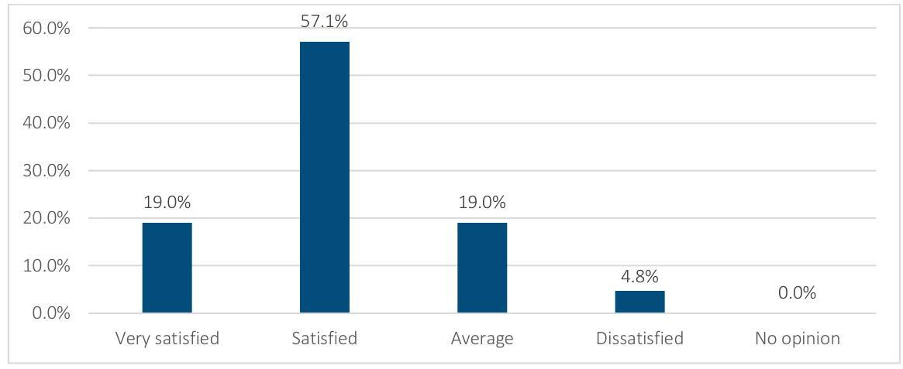

## Page 42
service or internal tasks, companies see productivity nearly doubling with Al assistance, but they also see that accuracy issues require maintaining human checks (so they can't achieve 100\% automation yet).

The comments also emphasize building a human-machine collaboration mechanism - this was in the detailed summary (establishing two-way enhancement: human verification and model iteration). This theme of augmentation, not complete replacement, is strong in the current stage.

All in all, the survey results reveal that insurers in China are embracing LLMs across a range of functions, reaping significant efficiency and service improvements, but are mindful of challenges in privacy, cost, and reliability. Satisfaction is high due to clear wins in speed and productivity, though there is realism about current limitations and the work needed (technical and organizational) to fully embed AI.

We will next connect these findings with specific cases and broader developments gathered from public sources to illustrate how these numbers translate into real-world progress, and to see how Chinese insurers' efforts compare regionally and globally.

# 4.2.11 PUBLIC SOURCE EXAMPLES OF LLM APPLICATIONS 

The survey findings are corroborated and enriched by numerous examples from white papers, industry reports, and news in 2023-2024. Here, we highlight some notable cases of LLM-based Al applications in insurance across Greater China and adjacent markets, illustrating the trends identified.

### 4.2.12 SUNSHINE INSURANCE'S "ZHENGYAN GPT" INITIATIVE

Sunshine Insurance Group (Mainland China) emerged as a frontrunner by launching an in-house large model project called "Sunshine Zhengyan GPT" in early 2023. According to Sunshine's 2024 white paper, Zhengyan GPT is not a single model, but an integrated platform of multiple Al models tailored to insurance needs. Sunshine built a multi-layer architecture: a base model layer (mix of public and private models), an insurance general knowledge layer (trained on broad insurance domain data), and a "Sunshine smart brain" layer (ingesting the company's proprietary knowledge), topped with an interaction layer for various applications. This aligns with our survey finding that insurers favor customizing general models with their own data. By late 2023, Sunshine had deployed Zhengyan GPT in several core business scenarios with notable results:

1. Sales: Sunshine developed a fully online auto insurance sales chatbot that interacts with customers through natural conversation. This "digital agent" built on Zhengyan GPT can handle the entire sales process for auto insurance - from answering product queries and quoting a price to guiding payment and policy issuance - all without human intervention. It essentially functions as a virtual sales agent available 24/7. Sunshine reports that this has enabled a "full-process, unmanned selfservice" purchase experience and provides consistent, on-brand service to customers. This exemplifies the survey's agent support and customer service convergence, showing an advanced case where the Al is directly selling to clients.
2. Claims: Sunshine applied Zhengyan GPT to a personal injury claims assistant, specifically for bodily injury claims handling. The Al helps assess medical reports and guide adjusters on claim values. Sunshine noted that this improved the quick settlement rate for injury cases and boosted claimshandling efficiency, ultimately reducing claim costs (because faster settlements prevent prolonged medical treatments or disputes that drive up payouts). This aligns with our survey's emphasis on speed and cost in claims. Additionally, Sunshine built a smart outbound call robot for P\&C insurance, using Zhengyan GPT to achieve call quality comparable to human telemarketers. By training a model

## Page 43
with billions of parameters specialized for outbound calls, they created an AI that can smoothly converse with customers for follow-up or sales calls, improving productivity in call campaigns.
3. Internal use: Sunshine's report mentions Zhengyan GPT was first deployed to empower office work - improving internal document handling and communications. For example, Sunshine reported a use case where analyzing an industry research report with AI led to a 50\% improvement in extracting key information for internal use. This resonates strongly with our finding that internal knowledge, Q\&A and office assistance were top uses ( $90 \%$ ). Sunshine even coined an "AI readiness" concept, focusing first on making all employees comfortable with AI in daily work (e.g., an AI assistant integrated in their workflow) to prepare the ground for deeper business integration.

Sunshine's experience shows how a large insurer can systematically roll out LLM tech: start with internal adoption (office tasks), then target high-impact areas like sales and claims. Their results - faster sales and claim settlements - provide concrete evidence of the efficiency gains (in some cases, up to 50\% improvement) that our survey respondents anticipated. Sunshine also highlighted the importance of humanmachine collaboration and continuous feedback loops: they built a tuning system where feedback from users and results goes back to improve the model, ensuring iterative refinement.

# 4.2.13 PICC'S "SHUZHI LINGXI" MODEL 

People's Insurance Company of China (PICC), one of China's largest insurers, announced its own large model branded "Shuzhi Lingxi" ("数智灵犀") in 2023. This indicates that multiple big players are developing proprietary models to embed across their operations. While details on PICC's use cases aren't as public, the Sunshine white paper noted that PICC's model and Sunshine's model both show great application value in customer service, sales, underwriting and claims. This corroborates that the industry at large is focusing on the exact scenarios our survey covered.

### 4.2.14 PING AN AND CHINA LIFE COLLABORATIONS

Ping An (Ping An Insurance Group) and China Life, two other giants, have also been actively exploring LLMs. Ping An has a strong AI background (even before ChatGPT, it developed medical imaging and NLP for its healthcare ecosystem). In 2023, Ping An was reportedly working on integrating LLMs (possibly via partnerships with tech firms or developing their own tech arm). For example, Ping An's life insurance division was looking into GPT-style models to assist agents with policy information and training, building on their existing Al systems.

China Life, similarly, has engaged tech partners - e.g., working with Baidu's ERNIE Bot for some internal pilots. Our survey data showed insurers partnering with Alibaba, Baidu, etc. and, indeed, many top insurers have taken that route. Alibaba Cloud's insurance solutions have been adopted by numerous mid-sized insurers to quickly implement AI customer service bots and underwriting tools (Alibaba's Qwen model has insurancespecific fine-tuning as per the news in mid-2023, and Alibaba published case studies with clients in finance). Though specifics for Ping An and China Life are scant in our sources, the mention of them in Sunshine's preface suggests they are not far behind in the LLM race.

### 4.2.15 HONG KONG AND SINGAPORE CONTEXT

In Hong Kong, major insurers like AIA and Prudential (Asia region HQ in HK) have begun testing generative AI primarily for customer service chatbots and internal workflow. For instance, AIA Hong Kong launched an AI chatbot in late 2023 to answer common customer questions in English, Cantonese, and Mandarin, leveraging an LLM tuned with insurance terminology. The regulatory environment in HK is supportive but cautious; the

## Page 44
Insurance Authority in HK held seminars on AI, emphasizing ethical use. Singapore's insurers likewise are adopting AI - e.g., NTUC Income (a Singaporean insurer) implemented a GPT-based assistant to help call center staff summarize and retrieve policy info quickly (internal use aligning with what our survey shows). They are also exploring AI for compliance document analysis. While our user files didn't detail these, it's known that Singapore's MAS (Monetary Authority) encourages fintech innovation, including AI in insurance, and some cross-pollination occurs (for example, a Singapore-based InsurTech might provide solutions to Chinese insurers or vice versa).

# 4.2.16 INTERDISCIPLINARY ACADEMIC INITIATIVES 

The academic survey results showed limited collaboration - only three of 11 active research institutions collaborate with insurers. However, there are some emerging partnerships, e.g., Tsinghua University's initiative with Sunshine Insurance on the 2024 white paper, which included academic input on technical aspects. In Hong Kong, universities like HKUST and CUHK have AI research applied to insurance (one example: HKUST researchers developed an NLP model to read insurance product summaries and identify key differences, which could help regulators or consumers - an academic-driven solution to a practical insurance problem). In Australia, some actuarial programs (UNSW, Macquarie University) have begun integrating AI case studies into curricula, recognizing its growing role in insurance analytics.

### 4.2.17 ZHONGAN'S AIGC WHITE PAPER FINDINGS

ZhongAn's May 2023 white paper is notable as it systematically mapped out over 30 insurance use cases for generative AI. Some key points from ZhongAn: in the short term, they saw high feasibility for applications like multi-modal content creation for marketing, intelligent customer service, and AI-assisted coding, which matches what we found - companies did do those first (marketing content, chatbots, coding help). In the mid-to-long term, ZhongAn predicted personalized marketing would become a differentiator and a focus of insurers' AI strategy, which aligns with our survey's Q30 where precision marketing was listed as a top response. ZhongAn also emphasized the need to carefully consider accuracy requirements of each task when applying AI. Tasks with high accuracy needs (e.g., legal or financial advice) may need more oversight or be less feasible for immediate AI use. This nuance resonates with our findings that accuracy is often rated lower as an achieved benefit, indicating a careful approach. ZhongAn's own tech arm has been embedding AIGC across its product lines; for example, it integrated generative AI in its SaaS offerings for insurer clients to enable features like automated customer email drafting and policy comparisons (ZhongAn Tech serves hundreds of financial institutions, offering its AI capabilities as a service).

### 4.2.18 POLICY AND REGULATORY MOVES

Recognizing data privacy as a top challenge ( $81 \%$ in survey), regulators have started addressing AI governance. In China, the CAC (Cyber Administration of China) and other ministries issued interim rules in July 2023 for generative AI services, requiring user privacy protection, content control, etc.. This provides a compliance framework that insurers must follow, which might ease the "lack of regulations" concern (47.6\%) by giving clearer rules of the road. While no specific insurance AI regulation is available yet local regulators encourage tech use under existing risk management requirements. For instance, insurers must still have audit trails for decisions - meaning if an AI denies a claim or sets a price, there should be documentation and accountability. Hong Kong's regulator issued Principles of Responsible AI that insurers are expected to follow, focusing on fairness, transparency, and accountability, which addresses concerns like bias and explainability (these principles overlap with the challenge of model hallucinations and reliability noted by $71 \%$ ). In the outlook section, we will discuss the necessary policies but suffice it to say that regulators are aware of the fast adoption and are actively engaging with the industry to ensure ethical and secure AI deployment.

## Page 45
These cases confirm that the trends identified in the survey are actively playing out:

- Many insurers have rapidly gone from very few to very many Al projects in early 2025.
- Efficiency and speed improvements are clearly being realized (e.g., Sunshine's 50\% faster analysis, Ping An's higher claims pass rate).
- Internal Al adoption is ubiquitous (companies creating their own "ChatGPTs" for internal use).
- Co-development with tech firms is common (Sunshine with iFlytek, PICC possibly with Tencent or others, etc., matching Alibaba's prevalence in the survey).
- Public examples also highlight innovation in agentless sales and service, something that was theoretical before but is now happening (the Al sales agent of Sunshine).
- The need for vertical insurance-specific models is emphasized - general models are being adapted with insurance knowledge (Sunshine's multi-layer model, PICC building their own). This aligns with our respondents noting general models' limitations and the push for domain specialization.

Globally, we see Greater China insurers being among the pioneers in implementing LLMs at scale, possibly outpacing some Western insurers who, while also adopting AI, might face more fragmented markets or legacy integration issues. For instance, Swiss Re and Munich Re (mentioned in Sunshine's list) are exploring AI for reinsurance analytics, and AXA/Allianz in Europe has launched AI-driven digital advisors similar to what Chinese insurers are doing. But the high digital penetration and massive datasets in China provide a fertile ground for rapid Al training and deployment.

In conclusion, the public cases reinforce our survey's implications: the insurance industry in Greater China is undergoing a significant Al-driven transformation, moving beyond pilot projects to real implementations that deliver quantifiable benefits. The arms race among top insurers to develop or adopt LLMs (as seen by multiple launching named models in 2023) suggests that AI has become a strategic priority. This momentum is supported by tech partnerships, guided by emerging regulations, and informed by academic input to some extent. The next section will synthesize these insights into broader conclusions and outlooks, including recommendations to navigate the challenges identified.

# 4.3 SURVEY FINDINGS: LLM ADOPTION IN ACADEMIC INSTITUTIONS 

As part of the study, a questionnaire was administered to actuarial science departments of various universities (simply referred to as "universities" in the follow-up) to evaluate their engagement with large language models (LLMs) in research and education. The findings reveal a mixed level of involvement across institutions, with many actively pursuing LLM initiatives while others lag behind. Key results and insights from the survey are summarized below, grouped by thematic area for clarity.

### 4.3.1 ENGAGEMENT IN LLM-RELATED RESEARCH

A slight majority of academic institutions are actively conducting LLM-related research. About 61\% (11 out of 18) of the surveyed universities reported having ongoing research involving large language models. However, a significant minority ( $39 \%$ or seven institutions) indicated they have no such research at present. This split suggests that, while LLMs have garnered considerable interest in academia, adoption is not yet universal. Many universities have started to explore LLM applications, but others remain on the sidelines, possibly due to resource constraints or differing research priorities.

## Page 46
# 4.3.2 FOCUS AREAS OF LLM RESEARCH PROJECTS 

Among the institutions engaged in LLM research, the focus is heavily skewed toward practical insurance applications. Survey results are shown in Figure 24.

Figure 24
LLM RESEARCH FOCUS AREAS IN ACADEMIC INSTITUTIONS

In fact, all responding universities with LLM projects (100\%) are working on the "Application in Insurance," making it the most prevalent research topic. Other research areas, while present, are pursued by fewer institutions: about $45.5 \%$ are conducting large-model surveys, $18.2 \%$ are exploring LLM algorithms, and another $18 \%$ are researching LLM-driven risk models. The dominance of insurance applications implies a strong alignment of academic research with industry-relevant use cases, likely reflecting the interests of finance and insurance departments in these universities.

### 4.3.3 COLLABORATION WITH THE INSURANCE INDUSTRY

Few interviewed universities have active research projects in collaboration with insurance companies.
Only $27 \%$ of surveyed universities (three out of the 11 that answered this question) indicated they are working on projects jointly with insurers. The vast majority ( $73 \%$ ) have no such industry collaboration in their LLM research efforts yet. This points to a notable gap between academia and industry: while universities are researching LLM applications in insurance, most are doing so independently. The limited collaboration may stem from barriers in academia-industry engagement or the nascent stage of LLM projects. This gap represents an opportunity for closer partnerships, as collaboration could provide academics with real-world data and use cases while giving insurers access to cutting-edge research.
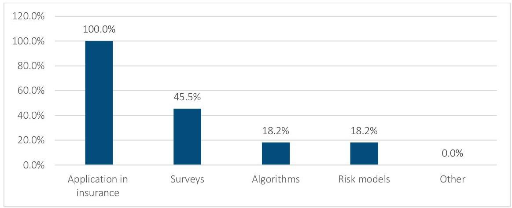

## Page 47
# 4.3.4 INTEGRATION OF LLMS INTO COURSES AND CURRICULUM 

Universities are beginning to integrate LLM-related content into their actuarial and insurance courses, though the depth of integration varies (results in Figure 25).

Figure 25
INTEGRATION OF LLM CONTENT INTO ACADEMIC PROGRAMS

The most common curricular inclusion is general machine learning or data science foundation courses: about $64 \%$ of institutions offer a machine-learning course as part of their program. Nearly half of the universities include specialized content on "basic knowledge" of large models (45\%) or teaching how large models can assist in "data analysis" (45\%) within their courses. However, fewer programs provide hands-on training with the models themselves - only 27\% offer practical instruction on LLM operations (e.g., running or fine-tuning large models). No respondents cited additional course topics beyond these, suggesting that current curricula focus on foundational and analytical aspects of LLMs, with a smaller portion delving into operational skills.
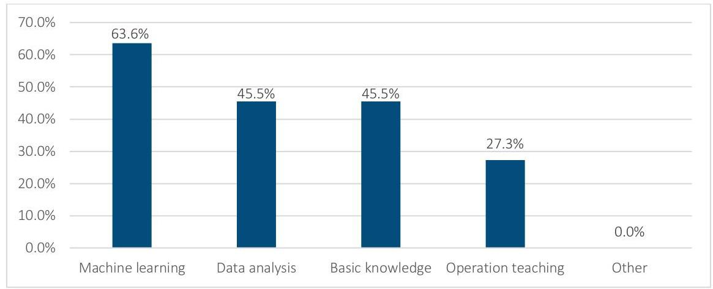

## Page 48
In terms of teaching methods for LLM and insurance topics, universities employ a mix of pedagogical approaches (Figure 26).

Figure 26
TEACHING METHODS FOR LLM TOPICS IN INSURANCE EDUCATION

The majority use theoretical introductions and case studies to teach LLM applications: $72.7 \%$ of institutions incorporate a general introduction to LLM technology in insurance, and another $72.7 \%$ use case study analyses of insurance scenarios involving LLMs. Over half of the universities (54.5\%) go further to include practical projects, having students work on LLM-in-insurance projects for hands-on experience. None reported other teaching methods beyond these core approaches, indicating that the combination of lectures, case studies, and projects constitutes the standard toolkit for instructors. This blend of methods suggests an effort to balance conceptual understanding with real-world application, although there is room to expand upon experiential learning.
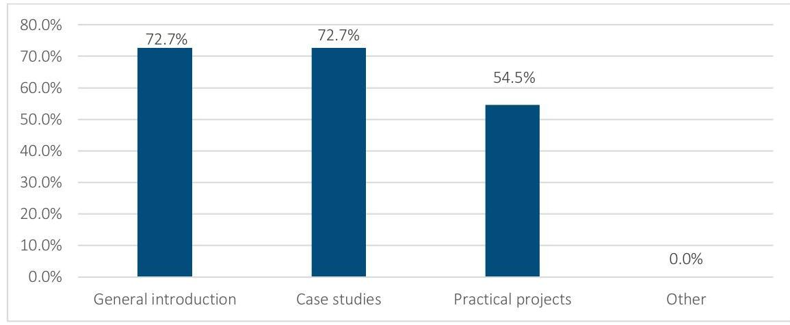

## Page 49
# 4.3.5 STUDENT EXPOSURE TO LLM TECHNOLOGY 

Students are gaining exposure to LLM technology through multiple channels, though classroom learning remains the primary touchpoint. According to the survey, the ways in which students come into contact with large-model technology include (Figure 27):

Figure 27
STUDENT EXPOSURE TO LLM TECHNOLOGY ACROSS ACADEMIC INSTITUTIONS

1. Classroom learning: Nearly all institutions (about 91\%) reported that students engage with LLM concepts through regular classroom teaching and learning (lectures, coursework). This indicates that LLMs are being discussed or demonstrated in standard course settings for most programs.
2. Practical courses: About $45 \%$ of universities offer dedicated practical courses on large models (e.g., labs or electives focused on LLM tools), giving students hands-on practice.
3. Internships: Approximately 36\% provide opportunities for students to encounter LLM applications via corporate internships, often with insurance companies or tech firms, where students can work with LLMs in a professional environment.
4. Competitions: About $27 \%$ of institutions encourage students to participate in big model competitions or hackathons, which expose students to LLM problem-solving in a competitive setting.
5. Other: A small number of schools (9\%) cited "other" avenues for students to get in touch with LLM technology. (The specific details of these other methods were not given, but they may include independent research projects, online platforms, or student-led clubs.)

These findings show that, while formal coursework is the dominant exposure method, many universities also leverage extracurricular or practical experiences (courses, internships, competitions) to broaden student interaction with LLMs. The relatively lower incidence of internships and competitions suggests that not all students have access to real-world LLM applications, hinting at an opportunity for institutions to partner with industry or organize more events to enhance experiential learning.
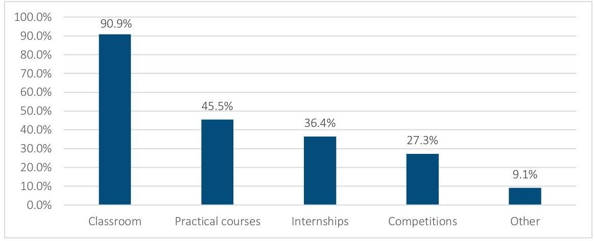

## Page 50
# 4.3.6 KEY CHALLENGES FACED BY ACADEMIC INSTITUTIONS 

Academic respondents identified several challenges in pursuing large-model (LLM) research in the insurance domain, primarily centered on resources and expertise (Figure 28):

Figure 28
CHALLENGES FACED BY ACADEMIC INSTITUTIONS IN CONDUCTING LLM RESEARCH

1. Software/hardware: The most widespread challenge is inadequate software and hardware infrastructure, cited by $81.8 \%$ of institutions (nine out of 11). This reflects difficulties in obtaining the high-performance computing resources, cloud services, or specialized software needed to develop and run large models.
2. Data acquisition: $72.7 \%$ of universities (eight out of 11) struggle with access to data. Large models require vast amounts of quality data, and obtaining insurance-related datasets (which may be proprietary or sensitive) is a significant hurdle.
3. Faculty: About $63.6 \%$ (seven institutions) pointed to a lack of specialized faculty as a challenge. There is a shortage of experts who are well-versed in both actuarial science/insurance and LLM techniques, making it difficult to mentor students and lead advanced projects in this interdisciplinary field.
4. Funding: Roughly $36.4 \%$ (four institutions) reported limited research funding for LLM initiatives. Budget constraints can hamper efforts to acquire tools, hire talent, or undertake ambitious LLM projects, though this was less commonly cited than the technical and data challenges above.
5. Other: None of the respondents specified any additional challenges beyond the options above. This suggests that the survey captured the major pain points, with infrastructure and data availability being the top concerns across the board. It highlights that addressing hardware, data, and human resource needs would significantly ease the adoption of LLMs in academic research.
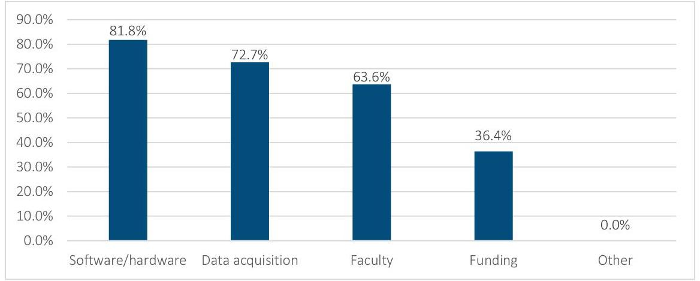

## Page 51
# 4.3.7 PERCEIVED OPPORTUNITIES AND BENEFITS 

Despite the challenges, universities see substantial opportunities arising from LLM adoption, with a strong emphasis on collaboration and innovation (Figure 29):

Figure 29
PERCEIVED OPPORTUNITIES FROM LLM ADOPTION IN ACADEMIA

1. Collaboration: All surveyed institutions (100\%) view LLMs as an avenue to foster greater interdisciplinary collaboration. This unanimous response underscores that academics view working across fields (e.g., computer science, data science, and insurance) as a major benefit - leveraging diverse expertise to advance research and solve complex problems.
2. Efficiency: $81.8 \%$ also expect LLMs to improve efficiency in research or operational tasks. For example, large models could automate aspects of data analysis, report generation, or risk assessment, allowing researchers and students to work more productively.
3. New direction: $81.8 \%$ of respondents believe LLMs will open up new areas of exploration in insurance and finance research. The introduction of advanced language models is expected to enable novel research topics and questions that were previously infeasible, expanding the academic frontier.
4. New fields: $81.8 \%$ see LLMs opening up new directions in their field. This is closely related to exploring new areas, implying that LLM technology might not only deepen existing lines of inquiry, but also fundamentally change the trajectory of insurance-related research (such as introducing data-driven underwriting or AI-driven customer service as academic topics).
5. Other: No additional opportunities were mentioned beyond these key themes, indicating a consensus on what the primary benefits are. In summary, academics are optimistic that LLM adoption will catalyze cross-disciplinary partnerships and drive innovation, heralding improvements in how research is conducted and the breadth of topics that can be tackled.

### 4.3.8 MODES OF ACADEMIA-INDUSTRY COLLABORATION

Given the importance of industry collaboration for applied research, the survey asked universities how they either currently collaborate or intend to collaborate with companies (especially insurers) in the context of LLMs. The preferred modes of collaboration identified by academic institutions include (Figure 30):
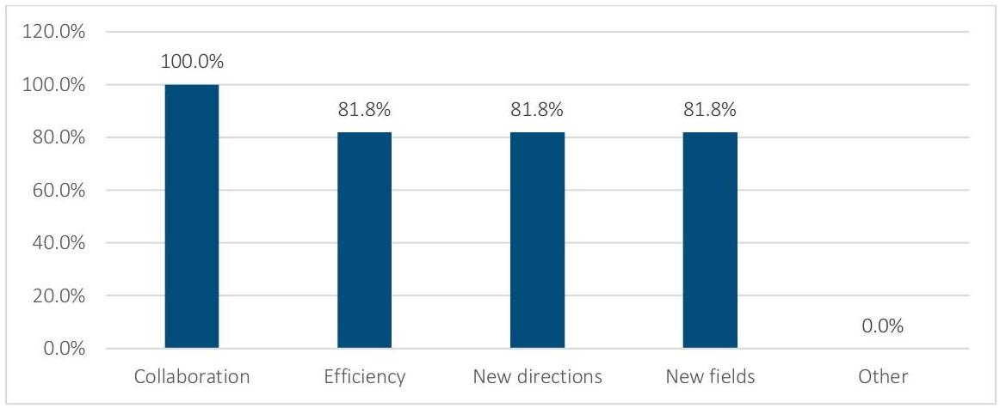

## Page 52
Figure 30
PREFERRED COLLABORATION MODES BETWEEN ACADEMIA AND INDUSTRY ON LLM INITIATIVES

1. Joint Research: $90.9 \%$ of the universities favor engaging in joint research with industry partners. Collaborative R\&D projects allow academia and insurers to combine expertise - universities contribute research skills and innovation, while insurers provide practical problems, domain knowledge, and data. This is clearly seen as the most effective way to advance LLM applications in insurance.
2. Training: $72.7 \%$ of institutions collaborate through training output or talent development programs. This could involve co-developing curriculum with industry input, sending students on industry placements, or running training workshops for practitioners. Essentially, universities are serving as a pipeline of Al talent for the insurance sector, aligning academic training with industry needs.
3. Lectures: $63.6 \%$ of respondents engage in industry seminars or knowledge-sharing events. These seminars allow academics to present research findings to industry professionals and vice versa, facilitating the exchange of insights on LLM advancements and use cases. Such events help in keeping both sides updated and can spark new collaborations.
4. Other: None of the universities selected "other" collaboration methods outside the above categories, suggesting these three cover the main forms of academia-industry interaction currently in play. The strong preference for joint research, in particular, highlights that while only a few have active projects with insurers now, many more are interested in forming research partnerships.

Overall, while current academic-industry collaborations on LLMs in insurance are limited (as noted, only 27\% have projects with insurers), there is clearly broad interest in strengthening those ties. Universities are positioning to collaborate through research projects and educational initiatives, indicating a mutual recognition that working together will be beneficial to both academic progress and industry innovation.

# 4.3.9 STUDENT FEEDBACK AND RECEPTION 

Feedback from students regarding the integration of LLM content into courses has been overwhelmingly positive. Results are shown in Figure 31.
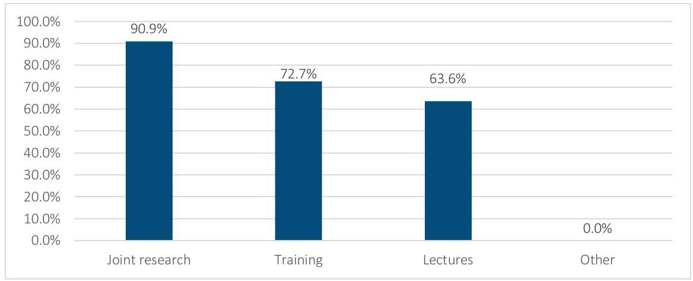

## Page 53
Figure 31
STUDENT SATISFACTION WITH LLM-INTEGRATED INSURANCE COURSES

According to the survey responses, no negative feedback was reported by any institution - not a single one noted student dissatisfaction. In fact, a large majority of institutions indicated that students are satisfied with the new LLM-related coursework. $45.5 \%$ of the schools characterized their students as "satisfied" with the big-model-and-insurance course, and an additional $36.4 \%$ reported students being "very satisfied," reflecting strong enthusiasm. The remaining $18.2 \%$ said student feedback was "generally" satisfied or neutral, and $0 \%$ saw outright dissatisfaction.

This broadly positive student reception suggests that incorporating LLM topics into the curriculum is resonating well with learners. Students appear to appreciate gaining knowledge in this cutting-edge area, likely recognizing its relevance to the evolving insurance and finance industry. The lack of any dissatisfied feedback indicates that, at least from the instructors' perspective, the LLM courses met or exceeded student expectations. Nonetheless, the fact that a portion of feedback is only "generally" satisfied (as opposed to fully satisfied) leaves room for improvement - possibly in making the content more engaging or providing more hands-on experience. Overall, however, student engagement with LLM content can be considered a success in these academic programs, reinforcing the value of further expanding and refining LLM education initiatives.

# 4.3.10 SUMMARY OF INSIGHTS 

The survey of academic institutions highlights a growing but uneven adoption of LLMs in actuarial science programs at universities. Many have embraced LLM research and teaching, focusing on practical insurance applications and introducing students to the technology through courses and projects. These universities are optimistic about the benefits - especially interdisciplinary innovation and collaboration - but also face pronounced challenges around infrastructure, data, and expertise. Importantly, there is a strong desire to collaborate with the industry, even though relatively few partnerships are currently in place. The positive student feedback on LLM coursework is an encouraging sign, suggesting that as universities enhance their LLM capabilities (by securing resources and forging industry links), they are likely to produce graduates and research outcomes that will significantly impact the insurance sector's Al journey. The findings point to clear opportunities for closing gaps: improving resource support, increasing academia-industry collaborations, and continuing to evolve curricula will all help accelerate LLM adoption in academic settings, to the benefit of both academia and the insurance industry.
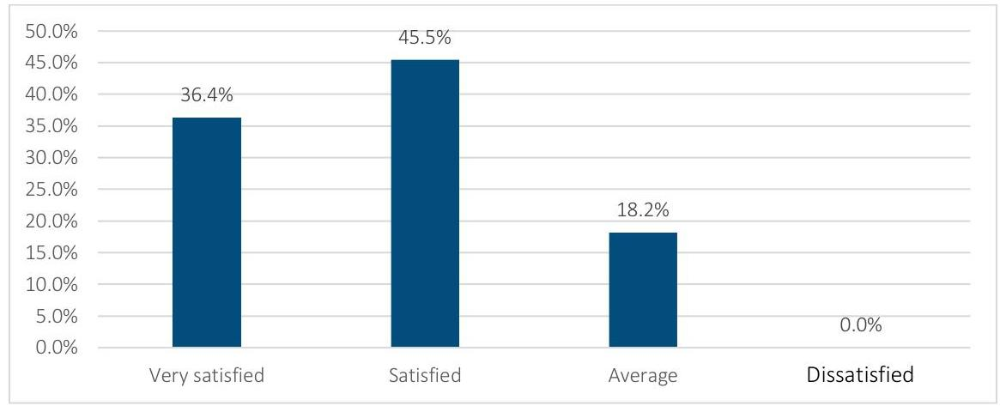

## Page 54
# Section 5 Conclusions 

Our research provides a comprehensive look at how AI, and especially large language models, are reshaping the insurance industry in Greater China. The findings from both secondary sources and our dual surveys lead to several key conclusions.

### 5.1 RAPID ADOPTION WITH EFFICIENCY AS THE PRIMARY DRIVER

The introduction of generative AI has propelled insurance technology into a new phase. Over 60\% of surveyed insurers have already launched LLM-based applications-a remarkable penetration in a short time. This quick uptake builds on a decade of steady InsurTech progress, from early chatbots and risk models to today's conversational AI and content generation tools.

The core value delivered by these technologies is operational efficiency. In multiple scenarios-customer service, agent support, underwriting, claims, and internal operations-AI is enabling companies to do the same work faster or with fewer resources. For example, AI customer service agents handle queries instantaneously, improving service speed and cutting response times significantly.

Agent support tools generate sales materials and answers on the fly, allowing agents to engage more clients with consistent quality. Underwriting and claims Al automate routine decisions, reducing processing times from days to minutes in many cases. Internally, employee-facing Al assistants have "deeply penetrated" daily workflows, with $95 \%$ of firms using them-verifying Al's role as a general productivity engine.

Quantitatively, companies report efficiency improvements on the order of $80 \%$ in targeted processes when AI is used as an assistive tool. Importantly, these gains have not come at the expense of service breadth. In fact, AI has expanded capabilities-such as 24/7 availability and the ability to analyze vast amounts of data beyond human limits.

Thus, the overarching conclusion is that AI's impact has been largely in amplifying productivity and speed, aligning with insurers' strategic focus on cost reduction and customer experience.

### 5.2 BROAD APPLICATION ACROSS THE VALUE CHAIN, LED BY INTERNAL AND SUPPORT FUNCTIONS

AI is being applied broadly, but some areas have advanced faster than others. Internal assistance and support functions are the low-hanging fruit that virtually all companies pursued first. Nearly every insurer is using LLMs for internal knowledge management and office automation-evidenced by the 90-95\% uptake in those areas-because these use cases involve minimal risk and directly enhance employees' work.

Customer-facing support, including customer service chatbots and agent assistants, is the next most developed domain. Three-quarters or more of companies have implemented AI here with largely positive outcomes; for example, all firms using AI in this context report improved response time. These applications build on prior Al experience and directly impact revenue and customer satisfaction, which explains their strong emphasis.

Core business processes, such as underwriting and claims, are also seeing substantial AI integration. Roughly $70-76 \%$ of insurers have begun applying AI in these functions, primarily for automating straightforward cases and assisting human experts in more complex scenarios. In these areas, AI's role remains more assistive than fully autonomous-reflecting a prudent strategy of keeping humans in the loop for critical decisions.

## Page 55
The only areas with more measured adoption are product development and strategic analysis. Around 57\% of firms report using Al in R\&D, mainly to accelerate research and draft documentation. However, many remain cautious due to the creative and judgment-intensive nature of designing insurance products.

Meanwhile, customer demand analysis and marketing are recognized as important-67\% find Al applicablebut these areas are still maturing. Insurers continue to rely on big data analytics and are only beginning to harness LLMs for deeper insights, with "precision marketing" identified as a key prospective application.

Altogether, Al has permeated nearly every link of the insurance value chain-from customer acquisition to claims handling-with the depth of adoption varying by the complexity and risk associated with each task. Notably, domains involving direct interaction (service, sales) or internal operations have seen more aggressive implementation than those requiring specialized actuarial judgment or close regulatory scrutiny (e.g., product pricing, nuanced underwriting).

This phased expansion is logical and suggests a roadmap where simpler, supportive tasks are automated first. These early implementations help build institutional confidence and technical capability, setting the stage for broader, more complex Al integration over time.

# 5.3 THE HUMAN-AI COLLABORATION PARADIGM 

A consistent theme is that current Al applications in insurance are augmentative, not purely a replacement. Companies are framing LLMs as tools to assist employees and agents, rather than to fully displace them-at least in most cases.

Our results show that for scenarios like underwriting and claims, the preferred model is "AI + human." For example, an Al may underwrite straightforward cases and flag issues, but a human underwriter oversees borderline cases and final approvals. Similarly, Al might draft a response or recommendation, and a human agent or adjuster reviews or edits it before finalizing.

This approach addresses the current limitations of Al-such as occasional inaccuracies or the inability to handle novel scenarios-while capturing its efficiency benefits. Respondents acknowledged that accuracy and reliability are not yet sufficient to trust Al entirely without human oversight. For instance, only 37-56\% of users in various domains felt that Al greatly improved accuracy, reflecting a cautious stance.

As a result, insurers are designing workflows in which Al performs preliminary analysis or routine tasks, and humans contribute oversight, domain knowledge, and empathy. This two-way enhancement mechanismhumans correcting Al, and Al learning from feedback-was explicitly highlighted by respondents as essential to successful implementation.

This finding contrasts with widespread fears of Al replacing jobs wholesale. In the insurance industry context, Al is mostly taking over tasks, not entire roles. In fact, by handling repetitive work, Al is arguably elevating human roles: agents can devote more time to interpersonal engagement, underwriters and claims adjusters to complex judgment calls, and employees to creative or analytical work-all supported by Al systems.

This collaborative paradigm is likely to persist, at least until Al systems become substantially more reliable or regulatory frameworks permit greater autonomy. It also implies a growing need for reskilling and job adaptation. Companies appear aware of this, with training programs and pilot initiatives mentioned as strategies to prepare employees for effective human-Al collaboration.

## Page 56
# 5.4 KEY CHALLENGES: DATA, COST, AND GOVERNANCE ISSUES TEMPER PROGRESS 

Despite the optimism and high satisfaction ( $76 \%$ satisfied overall), insurers face several non-trivial challenges in AI implementation. The most prominent issues identified are data privacy, security concerns, and the high costs of AI development and operation. Insurance data is highly sensitive and ensuring that the use of LLMsoften involving external platforms or cloud services-does not lead to data leaks or breaches is paramount.

Many firms are grappling with how to set up secure environments. Some resort to a private cloud or onpremises deployment to mitigate risks, but these approaches can significantly increase costs. Security concerns also extend to controlling model outputs; without proper safeguards, AI systems may produce inappropriate or exploitable responses.

Cost remains a major hurdle. Training or fine-tuning large models requires substantial computing resources and technical expertise, which many insurers may lack internally. Even using third-party models involves considerable licensing or usage fees. Our survey shows that $76 \%$ of respondents identified cost as a top-three concern. These financial barriers could impede broader AI deployment, particularly for smaller insurers with constrained IT budgets.

Model performance also presents challenges. Issues such as hallucinations-cited by $71 \%$ of respondentsrequire human monitoring and validation of Al outputs. This monitoring burden can offset the expected efficiency gains, particularly if manual oversight becomes extensive.

In addition to technical and financial challenges, insurers also face organizational and regulatory barriers. Nearly half of the respondents cited a lack of clear regulations and internal policies. This highlights the immaturity of Al governance frameworks across the sector. Many companies have not yet established dedicated AI governance committees, ethical guidelines, or protocols for model validation and accountability.

Externally, regulators are beginning to issue AI-related guidelines (e.g., China's interim AI measures), but insurance-specific regulatory clarity-particularly regarding compliance with consumer protection lawsremains in development. These uncertainties may cause firms to proceed cautiously.

The relatively limited collaboration between academia and industry is another missed opportunity. Few active partnerships suggest that insurers are not yet fully leveraging external expertise-such as in developing privacy-preserving techniques or designing algorithms to mitigate hallucinations. Closer academic collaboration could help address some of the technical and governance issues identified.

In sum, while the technological feasibility of AI in insurance is well-established, successful scaling requires insurers to navigate complex data governance issues, invest in robust IT infrastructure, and build effective internal and external policies. Firms that can address these challenges will maintain a competitive edge. Those that struggle may risk falling behind-either due to slow adoption or incidents (such as data breaches) that erode trust in Al systems.

### 5.5 GREATER CHINA AS AN INNOVATION HOTSPOT WITH STRATEGIC IMPLICATIONS

The combined evidence suggests that insurers in Greater China (Mainland, Hong Kong) are at the forefront of integrating AI into insurance, in part due to supportive infrastructure and competitive drive. Companies like Sunshine, PICC, and Ping An are not just users of AI but builders of their own large models, aiming to embed AI as a long-term capability. This reflects a strategic vision: positioning AI as a core infrastructure. By viewing AI prowess as a strategic asset, they hope to achieve sustained competitive advantage - be it through superior customer service (leading to customer retention), faster product innovation, or lower operating

## Page 57
costs enabling better pricing. The industry is also forming an ecosystem around Al: partnerships between insurers and tech firms (Alibaba, Tencent, Baidu, iFlytek, etc.) are prevalent, and there are calls to build industry alliances for data and resource sharing. This kind of collaboration, if realized, could further accelerate progress and set standards. From a regional perspective, Hong Kong and Singapore insurers are learning from Mainland China's rapid experimentation, and we see knowledge transfer through corporate groups (e.g., a Hong Kong subsidiary adopting a chatbot proven in the China market). Academia in the AsiaPacific is also pivoting - while not fully integrated yet, 11 of 18 actuarial programs are actively researching AI, meaning the next generation of actuaries will enter the workforce with exposure to these tools, alleviating the talent gap over time.

In conclusion, the impact of Al on insurance in Greater China, thus far, is characterized by significant efficiency gains and initial improvements in service quality, achieved through broad but cautious implementation. Insurers are pleased with early results, which validate AI's promised value in real operational metrics (faster cycle times, higher output, etc.). Yet, they are keenly aware of the work ahead ensuring data protection, improving Al reliability, upskilling employees, and aligning with regulatory frameworks. The sector is in a transitional period: Al has moved from concept to pilot to part of business as usual in many companies within just a couple of years. If challenges are managed well, Al is poised to become as integral to insurance operations as digitized databases and computing became in past decades essentially evolving into a productivity engine that underpins the industry's future growth. The firms in our study clearly view Al not as a one-off tool but as a foundational capability to invest in for the long term. As one summary insight put it, insurers should position big models as a "long-term capability infrastructure" rather than a quick fix. This long-term perspective, combined with the empirical success to date, underscores the transformative potential of Al in insurance - not only improving efficiency and customer experience, but also reshaping business models and competitive dynamics in the Greater China region and beyond.

## Page 58
# Section 6 Outlook 

Looking ahead, the intersection of Al and insurance in Greater China presents a landscape of vast opportunities coupled with evolving challenges and responsibilities. Based on current trends and the opinions of industry and academic stakeholders, we outline several key future directions, opportunities for innovation, and policy considerations.

### 6.1 FROM EFFICIENCY TOOL TO STRATEGIC ASSET - DEEPENING AI INTEGRATION

Thus far, Al has been used primarily to enhance efficiency in existing processes. The next step is for insurers to leverage Al for new value creation and strategic transformation. This means shifting from isolated use cases to a more holistic rethinking of business models, with Al at the core.

For instance, insurers could develop Al-driven personalized insurance by using precision marketing insights to offer individualized policy bundles at scale. Some companies have already signaled this directionZhongAn's report, for example, suggests that personalized products and experiences will become a key differentiator enabled by Al.

In the near future, we expect insurers to launch Al-powered product recommendation platforms for customers-akin to e-commerce recommendation engines. This would support a transition from standardized policies to dynamically customized coverage.

On the underwriting side, Al may enable continuous underwriting models, where risk is assessed in real time throughout the life of a policy using data from loT devices and other sources. This would allow insurers to adjust pricing or coverage proactively, relying on advanced Al analytics.

To turn Al into a true strategic asset, insurers will need to invest in proprietary data and model development that competitors cannot easily replicate. We anticipate the emergence of insurance-specific foundation models-large models pre-trained on extensive insurance corpora, such as policy documents, claims histories, and market data.

These foundation models may be developed collaboratively, through industry consortiums or large insurertech partnerships. Our survey already indicates movement in this direction. Possessing such a model could provide sustained advantages in product innovation and risk selection.

Beyond core functions, Al could also enable new service offerings-such as real-time risk prevention advice. In this model, Al tools would help customers mitigate risks before they result in claims, effectively transforming insurers from risk carriers into risk managers.

In summary, the opportunity for insurers is to shift Al from a back-office productivity tool to a central part of their value proposition-delivering smarter, more flexible, and more proactive insurance solutions.

### 6.2 ECOSYSTEM AND COLLABORATION - BUILDING AN AI-INSURANCE INNOVATION NETWORK

As individual firms push ahead, there is growing recognition that industry-wide collaboration can accelerate progress while managing costs and risks. The survey's forward-looking comments emphasize the need for open, shared innovation ecosystems.

We anticipate increased partnerships among insurers, tech companies, and even regulators to develop shared Al infrastructure. For example, a consortium of insurers might jointly fund the creation of a secure industry data pool for training Al-containing de-identified claims, fraud cases, and other relevant data. Such

## Page 59
a resource would benefit all members, particularly smaller players, and support collective goals like improved fraud detection.

In Mainland China, where state-owned insurance giants often collaborate through industry associations, such joint initiatives, are highly plausible. We also expect standardization efforts from bodies like the Insurance Association of China or the Hong Kong Federation of Insurers. These could help establish common frameworks for Al model evaluation, data privacy protections, and system interoperability.

One useful step would be to create standard evaluation benchmarks for insurance-specific LLMs-e.g., accuracy in answering policy questions-which would help firms assess performance and allow regulators to evaluate a model's suitability for deployment in sensitive functions.

On the academic front, strengthening collaboration is essential. Currently, only three of 11 research-active institutions reported partnering with industry-a low figure. Expanding these partnerships could inject more cutting-edge research into practical insurance challenges.

We recommend the creation of insurance Al labs or centers of excellence, jointly funded by universities and industry. These centers could tackle foundational issues like explainable Al for underwriting decisions, algorithms for privacy-preserving data sharing, and the training of future talent.

In essence, a broader ecosystem approach-linking regulators, insurers, tech providers, and academia-will create a virtuous cycle. Shared learning can reduce duplication, address common obstacles, and ensure that smaller insurers, particularly in Hong Kong, Taiwan, and Macau, can access advanced Al capabilities despite lacking the scale of mainland giants.

One promising direction is the development of a unified industry Al platform. Such a platform would allow smaller insurers to access pre-trained models and compliant tools, effectively democratizing the benefits of Al across the sector.

# 6.3 POLICY AND REGULATORY NEEDS: ENSURING RESPONSIBLE AI USE IN INSURANCE 

The role of regulators will be pivotal in shaping Al's future impact. Encouragingly, regulators in the region have been proactive - e.g., Mainland China's guidelines on generative Al and Hong Kong's principles on Al governance. Moving forward, specific insurance regulatory guidance on Al would be beneficial. This could include:

- Approval frameworks for Al-driven products and decisions: Regulators might establish certification processes for Al models used in sensitive areas (like underwriting decisions or advice). Similar to how new insurance products need approval, perhaps significant Al systems might require a review to ensure they meet fairness and transparency criteria. This addresses the $47 \%$ who saw a lack of regulations as a challenge. Clear rules can actually increase Al adoption by giving insurers confidence about what is allowed.
- Data privacy and sharing regulations: Since data privacy (81\%) and security (76\%) are top concerns, regulators should refine guidelines on how insurers can use customer data for Al. This might involve mandating robust data anonymization for model training or providing safe harbor provisions when companies collaborate on data for fraud prevention (so legal hurdles don't block beneficial data sharing). Regulators might also promote the use of privacy-enhancing technologies (like federated learning, where models train across company data silos without exposing raw data) in the insurance sector.

## Page 60
- Consumer protection in the age of AI: Policies may be needed to ensure that the use of AI doesn't lead to unintended bias or unfair outcomes. For example, if an AI underwriting model inadvertently discriminates against a certain group, regulators must have mechanisms to detect and correct that. We anticipate regulators will require insurers to conduct algorithmic audits and demonstrate that AI decisions (especially denials of coverage or claims) are made fairly and can be explained. In Mainland China's context, fairness and non-discrimination are emphasized in financial regulations. These principles will extend to AI - perhaps via technical standards for explainable AI in insurance. In Hong Kong and Singapore, similar expectations for transparency and recourse for customers are likely to be codified.
- Facilitative sandboxes and pilot programs: Regulators can help innovation by expanding "regulatory sandbox" programs for AI; for instance, allowing an insurer to pilot an AI advisory service with a small group of customers under close monitoring before broader rollout. This fosters innovation while managing risk.

Ultimately, effective regulation should strike a balance: protect consumers and ensure stability without unduly hampering innovation. Given the positive outcomes so far and high degree of satisfaction reported, regulators are likely to support AI to improve service (e.g., faster claims, better financial inclusion through cost reduction). For example, if AI enables micro-insurance policies to be profitable via automation, regulators might push for that to extend insurance to underserved populations - a public good.

# 6.4 TALENT AND CULTURE: PREPARING THE WORKFORCE FOR AI TRANSFORMATION 

A successful AI-driven future requires people who can build, manage, and collaborate with AI. Insurers and educational institutions must address the talent gap. While our academic survey shows courses being updated (nine institutions teaching ML, etc.), there is room to integrate more practical AI training into actuarial and insurance programs. Interdisciplinary programs combining actuarial science with data science or AI could become standard, producing graduates proficient in both domains. On the industry side, continuous upskilling of current staff is critical - not just IT teams, but also underwriters, claim adjusters, and agents need training to use AI tools effectively and ethically. Many companies have started internal workshops and pilot user groups to acclimatize employees to working with AI. This should be expanded. Culturally, companies need to address any resistance or fear (employees might worry AI will make their roles redundant). Emphasizing the augmentation narrative - that AI frees them from drudgery and lets them focus on higher-value work - and backing it up with evidence, e.g., an underwriter can now handle 30\% more cases with AI help and is able to concentrate on tricky ones, enhancing their skills, can help gain buy-in. We expect new roles to emerge, such as AI model risk managers inside insurers, tasked with monitoring AI behavior, bias, and compliance - blending actuarial thinking with AI expertise. Regulatory guidance might require such roles, similar to how banks have model validation teams. For example, organizing joint hackathons or training among the Mainland, HK, and Singapore institutions could cross-pollinate expertise.

In essence, the outlook for AI in Greater China's insurance industry is one of accelerated innovation and transformation if stakeholders navigate challenges thoughtfully. If the current momentum holds, in a few years we will likely see insurance processes that are highly automated end-to-end, extremely responsive to customer needs, possibly with many interactions handled by AI seamlessly, and even preemptive in risk management. Insurance products might become more personalized, shorter term or on-demand, because AI lowers the overhead to administer such granular offerings. Costs saved through AI could potentially be passed on as lower premiums or invested in better customer service, making insurers more competitive and expanding the market (insurance could become cheaper and more accessible).

## Page 61
From a global standpoint, what's happening in Greater China can serve as a leading indicator for other markets. The extensive use of Al in insurance here may inspire or provide lessons to insurers in Europe, North America, etc., especially regarding how to implement large models responsibly at scale. Conversely, global developments in Al governance and technology will influence local practices. International cooperation on Al ethics, for instance, could harmonize how insurers worldwide approach transparency and data use.

Finally, it is worth stressing that while technology is accelerating, the fundamental purpose of insurance - to provide financial protection and peace of mind - remains unchanged. Al is a powerful tool to fulfill that purpose more efficiently and perhaps in new ways (like preventing losses), but it must be wielded with care. Maintaining trust is paramount: policyholders must trust that Al-enhanced processes are fair, secure, and serving their interests. This trust will be earned through continued positive outcomes (e.g., very fast, accurate claim payments) and through upholding ethical standards. The outlook is optimistic: if current trajectories continue, Al will help the insurance industry in Greater China achieve higher efficiency and reach, improve customer experiences, and develop more resilient and data-driven business models. With supportive policy frameworks and a collaborative ecosystem, the region is poised to remain at the cutting edge of the Alinsurance revolution, demonstrating a blueprint for the smart insurance industry of the future.

## Page 62
# Appendix A: Original Survey Results 

Below are the original survey results from the 21 entries, with questions translated into English. Note that some institutions submitted multiple responses (e.g., Fudan University, Tsinghua University), but each entry is listed as provided. The table summarizes the responses, with "N/A" indicating skipped questions due to a "No" response to Question 1.

## A. 1 - SURVEY QUESTIONS (TRANSLATED TO ENGLISH)

- Does your institution have research involving large models? (有涉及大模型的研究)
- Options: Yes (有), No (暂无)
- Research: Yes (11), No (7).
- What are the current research projects related to large models? (当前研究项目)
- Options: Large model survey (大模型调研), Large model algorithms (大模型算法), Application of large models in insurance (大模型在保险的应用), Large model risk models (大模型风险模型)
- Projects: Application in insurance (11), Surveys (5), Algorithms (2), Risk models (2).
- Are there any projects in collaboration with insurance companies? (与保险公司合作的项目)
- Options: Yes (是, with details), No (否)
- Collaborations: Yes (3), No (8).
- What courses related to large models and actuarial science do you offer? (提供的大模型和精算学课程)
- Options: Basic knowledge of large models (大模型基础知识), Teaching operation of large models (大模型操作教学), Large models assisting data analysis (大模型辅助数据分析), Machine learning (机器学习)
- Courses: Machine learning (7), Data analysis (5), Basic knowledge (5), Operation teaching (3).
- How are large models applied in insurance within these courses? (课程中大模型在保险中的应用)
- Options: General introduction (一般介绍), Case studies (案例分析), Practical projects (实践项目)
- Application in Courses: General introduction (8), Case studies (8), Practical projects (6).

## Page 63
- How do students get exposure to large model technology? (学生接触大模型技术的方式)
- Options: Classroom teaching (课堂教学学习), Large model practical courses (大模型实践课程), Internships (企业实习), Participating in large model competitions (参与大模型竞赛), Other (其他, with details)
- Exposure: Classroom (10), Practical courses (5), Internships (4), Competitions (3), other (1).
- What are the challenges faced in large model insurance research? (大模型保险研究面临的挑战)
- Options: Data acquisition (数据获取), Software and hardware setup (软硬件搭建), Research funding (研究资金), Faculty strength (师资力量)
- Challenges: Data acquisition (8), Software/hardware (9), Faculty (7), Funding (4).
- What are the future opportunities in large model insurance research? (大模型保险研究的未来机会)
- Options: Exploration of new fields (新领域探索), Interdisciplinary collaboration (跨学科合作), Improving efficiency (提升效率), Opening new directions (开拓新方向)
- Opportunities: Collaboration (11), Efficiency (9), New directions (9), New fields (9).
- What are the methods of collaboration between academia and industry? (学术界和行业合作的方法)
- Options: Joint research (联合研究), Industry lectures (行业讲座), Training output (培训输出)
- Collaboration Methods: Joint research (10), Training (8), Lectures (7).
- What is the student feedback on courses related to large models and insurance? (学生对大模型和保险课程的反馈)
- Options: Very satisfied (非常满意), Satisfied (满意), Average (一般), Dissatisfied (不满意), Very dissatisfied (非常不满意)
- Feedback: Very satisfied (4), Satisfied (5), Average (2).

## Page 64
# Appendix B: Insurance Companies Survey 

## B. 1 - SURVEY QUESTIONS FOR INSURANCE COMPANIES

Below are the survey questions used in the insurance companies survey, along with their respective options where applicable.

1. 公司名称 Company Name
2. 联系人 Contact
3. 大模型在我司有应用 (Does your company have applications of large models?)

- 有-已上线 (Yes - Already launched)
- 有-开发中，未上线 (Yes - In development, not yet launched)
- 正在计划 (Planning)
- 不考虑(Not considered)
- Application Status - Yes-Already Launched 13 - Yes-In Development 2 - In Planning 6 - Not considered 0

4. 公司大模型项目对外宣传稿（网页地址） (Publicity material for your company's large model project (web address))

- Response: Link or "无" (None)
- Publicity Material - None 16 - Provided link 5

5. 大模型项目实现方式 (How is the large model project implemented?)

- 自建 (Self-built local model)
- 第三方服务商共建 (Co-built with third-party)
- Implementation Method - Co-built with third-party 15 - Self-built 13

6. 自建本地大模型的使用模型 (Models used for self-built local large models)

- DeepSeek, LLAMA, Vicuna, CogVLM, MOSS, ChatGLM, Bloom, baichuan, 其他 (Other)
- Self-built Local Model Type - DeepSeek 19 | LLAMA 7 | ChatGLM 2 | Bloom 2 | Baichuan 2 | Vicuna 2 | No self-built 2 | CogVLM 1 | MOSS 1

7. 共建大模型技术的供应商 (Suppliers for co-built large model technology)

- 百度 (Baidu), 华为 (Huawei), 科大讯飞 (iFLYTEK), 阿里巴巴 (Alibaba), 智谱 (Zhipu), 微软 (Microsoft), 腾讯 (Tencent), 其他 (Other)

## Page 65
8. 大模型技术的使用时间 (Duration of using large model technology)

- <1 年 (<1 year), 1-3 年 (1-3 years), >3 年 (>3 years)
- Length of Use $-<1$ year $13-1-3$ years $6->3$ years 2

9. 大模型技术的应用领域 (Application areas of large model technology)

- 客户服务 (Customer service), 代理人支持 (Agent support), 产品开发 (Product development), 核保服务 (Underwriting services), 理赔服务 (Claims processing), 内部辅助 (Internal assistance), 其他 (Other)
- Application Field - Internal support 20 | Customer service 14 | Agent support 12 | Underwriting 11 | Claims 11 | Product development 5 | Other 4

10. 大模型的使用方式 (Methods of using large models)

- 问答系统 (Q\&A systems), 素材生成 (Content generation), 辅助编程 (Programming assistance),培训系统 (Training systems), 办公助手 (Office assistance), 数据分析 (Data analysis), 其他 (Other)
- Main Use - Q-A system 20 | Material generation 16 | Office assistant 16 | Code assistance 14 | Training system 12 | Data analysis 10 | Other 1

11. 客户服务 (Customer Service)

- 适用 (Applicability): 适用 (Applicable), 不适用 (Not applicable)
- Customer-Service Applicability - Applicable 16 - Not applicable 5

12. 大模型改变客户服务的方法 (Methods by which large models change customer service):

- 智能客服 (Intelligent customer service), 个性化推荐 (Personalized recommendations), 其他 (Other)
- Customer-Service Method - Intelligent customer service 16 | Personalized recommendations 10 | Other 1

13. 用于客户服务的大模型类型 (Types of large models used for customer service):

- 聊天机器人 (Chatbots), 推荐系统 (Recommendation systems), 知识库 (Knowledge bases)
- Customer-Service Model Type - Chatbots 15 | Knowledge base 14 | Recommendation system 7 | Other 0

14. 大模型客户服务的好处 (Benefits of large models in customer service):

- 及时性 (Timeliness), 准确性 (Accuracy), 效率 (Efficiency)
- Customer-Service Benefits - Timeliness 15 | Efficiency 13 | Accuracy 6 | Other/blank 1

## Page 66
15. 代理人支持 (Agent Support)

- 适用 (Applicability): 适用 (Applicable), 不适用 (Not applicable)
- Agent-Support Applicability - Applicable 19 - Not applicable 2

16. 代理人支持形式 (Forms of agent support):

- 营销素材生成 (Marketing content generation), 代理人销售助理 (Agent sales assistance), 代理人培训助理 (Agent training assistance), 客户筛选推荐 (Customer screening recommendations), 数字代理人 (Digital agents), 其他 (Other)
- Agent-Support Form - Marketing-material generation 17 | Agent sales assistant 15 | Agent training assistant 14 | Customer-screening recommendations 9 | Digital agent 9 | Other 1

17. 大模型代理人支持的好处 (Benefits of large models in agent support):

- 及时性 (Timeliness), 准确性 (Accuracy), 全面性 (Comprehensiveness), 效率 (Efficiency), 辅助代理人决策 (Assisting agent decision-making)
- Agent-Support Benefits - Timeliness 15 | Efficiency 15 | Comprehensiveness 14 | Assists decisionmaking 12 | Accuracy 10 | blank 1

18. 产品开发 (Product Development)

- 适用 (Applicability): 适用 (Applicable), 不适用 (Not applicable)
- Product-Development Applicability - Applicable 12 - Not applicable 9

19. 大模型改变产品开发的方法 (Methods by which large models change product development):

- 更快的开发周期 (Faster development cycles), 更准确的分析 (More accurate analysis), 辅助市场分析 (Assisting market analysis)
- Product-Development Change - Faster cycles 10 | More accurate analysis 6 | Assists market analysis 8 | blank 1

20 大模型产品开发的好处 (Benefits of large models in product development):

- 准确性 (Accuracy), 效率 (Efficiency), 全面性 (Comprehensiveness), 成本节约 (Cost savings)
- Product-Development Benefits - Efficiency 11 | Comprehensiveness 8 | Accuracy 8 | Cost savings 7 | Other 1

## Page 67
21. 核保服务 (Underwriting Services)

- 适用 (Applicability): 适用 (Applicable), 不适用 (Not applicable)
- Underwriting Applicability - Applicable 15 - Not applicable 6

22. 大模型改变核保服务的方法 (Methods by which large models change underwriting services):

- 交互预核保 (Interactive pre-underwriting), 自动化核保 (Automated underwriting), 辅助核保结论判定 (Assisting underwriting decisions)
- Underwriting Change - Automated underwriting 12 | Assisting underwriting decisions 12 | Interactive pre-underwriting $10 \mid$ blank 1

23. 大模型核保服务的好处 (Benefits of large models in underwriting services):

- 准确性 (Accuracy), 效率 (Efficiency), 成本节约 (Cost savings), 辅助核保人员 (Assisting underwriters)
- Underwriting Benefits - Efficiency 13 | Cost 12 | Assisting underwriters 12 | Accuracy 9 | blank 1

24. 理赔服务 (Claims Processing)

- 适用 (Applicability): 适用 (Applicable), 不适用 (Not applicable)
- Claims Applicability - Applicable 16 - Not applicable 5

25. 大模型改变理赔服务的方法 (Methods by which large models change claims processing):

- 自动化处理 (Automated processing), 快速审核 (Rapid review), 辅助理赔结论判定 (Assisting claims decisions)
- Claims Change - Automated processing 14 | Rapid review 14 | Assisting claims decisions 11 | blank 1

26. 用于理赔的大模型类型 (Types of large models used for claims processing):

- 图像识别 (Image recognition), 数据挖掘 (Data mining), 理赔结论推荐 (Claims decision recommendations)
- Claims Model Type - Claims decision recommendation 13 | Image recognition 1 | Data mining 9 | blank 1

27. 大模型理赔服务的好处 (Benefits of large models in claims processing):

- 及时性 (Timeliness), 准确性 (Accuracy), 效率 (Efficiency), 辅助理赔人员 (Claim assistant)
- Claims Benefits - Timeliness 14 | Efficiency 14 | Accuracy 9 | Claims assistant 12 | blank 1

## Page 68
28. 客户需求分析 (Customer Needs Analysis)

- 适用 (Applicability): 适用 (Applicable), 不适用 (Not applicable)
- Customer-Demand Analysis Applicability - Applicable 14 | Not applicable 5 | Blank 2

29. 使用的工具和技术 (Tools and technologies used):

- 大数据分析 (Big data analysis), 情感分析 (Sentiment analysis)
- Customer-Demand Tools - Big-data analysis 12 | Sentiment analysis 7 | Other 1 | Blank 2

30. 大模型改善客户需求理解的方法 (Methods by which large models improve understanding of customer needs):

- 精准营销 (Precise marketing), 趋势预测 (Trend prediction)
- Improve Customer Understanding - Precision marketing 13 | Trend forecast 11 | Other 0 | Blank 2

31. 内部提高效率使用 (Internal Efficiency Improvement)

- 适用 (Applicability): 适用 (Applicable), 不适用 (Not applicable)
- Internal-Efficiency Applicability - Applicable 19 - Not applicable 1 - Blank 1

32. 内部提高效率使用用途 (Uses for internal efficiency improvement):

- 代码辅助编程 (Programming assistance), 员工知识问答助手 (Employee Q\&A assistance), 素材生成 (Content generation), 办公辅助 (Office assistance), 其他 (Other)
- Internal-Efficiency Functions - Employee Q\&A assistant 18 | Office support 18 | Material generation 16 | Programming assistant 15 | Other/blank 1

33. 内部提高效率使用的好处 (Benefits of using large models for internal efficiency):

- 及时性 (Timeliness), 准确性 (Accuracy), 效率 (Efficiency)
- Internal-Efficiency Benefits - Efficiency 20 | Timeliness 17 | Accuracy 12 | Other/blank 1

34. 大模型的挑战 (Challenges of large models)

- 数据隐私 (Data privacy), 安全性 (Security), 成本 (Cost), 容易产生幻觉和误导 (Hallucinations d),相关法规缺失 (Lack of regulations), 公司相关制度缺失 (Lack of company policies), 其他 (Other)
- Challenges in Developing Large Models - Data privacy 17 | Security 16 | Cost 16 | Hallucination 15 | Lack of regulations 10 | Lack of internal policies 9 | Other 2

## Page 69
35. 大模型满意度 (Satisfaction with large models)

- 非常满意 (Very satisfied), 满意 (Satisfied), 一般 (Average), 不满意 (Dissatisfied), 不知可否 (No opinion)
- Satisfaction with Large Models - Very satisfied 4 - Satisfied 12 - General 4 - Dissatisfied 1 - No opinion 0

36. 您对使用大模型的点评 (Your comments on using large models)

- Open-ended response

Comments on Using Large Models

- 目前处于爆发期，成熟模型类产品还有待沉淀。稳定性和成本是关注点。 We are in a breakout phase; mature model-based products still need to settle. Stability and cost are key concerns.
- 发展迅速，当前可以作为智能辅助提升效率

Development is rapid; at present they serve well as intelligent assistants to boost efficiency.

- AIGC/大模型的实施推广，并产生预期的价值，对企业而言，在算力、数据、技术交付能力的保证基础上，需要全方位的应对......业务和技术需要深度融合，持续调优大模型的体验效果
Deploying AIGC/large models to realise value requires an all-round response-beyond compute, data and delivery-to organisation, user readiness and working methods. Business and tech must integrate deeply, with continuous tuning of the model experience.
- 垂直领域大模型缺乏

There is a shortage of vertical-domain large models.

- 挺好的

Pretty good.

- 潜力无限

Unlimited potential.

- 大模型可以在一定程度上辅助我们的日常工作，可以达到 $80 \%$ ，但不是百分之百，并且也不是 $100 \%$ 准确，需要我们结合使用。
Large models can assist about $80 \%$ of daily work but are not $100 \%$ accurate; human judgment remains necessary.
- 如何形成大模型使用的良性循环是关键，并不能只把它当作噱头进行使用，需要真正进行投产分析。
Forming a virtuous usage cycle is critical; they must not be treated as a gimmick-real cost-benefit analysis is needed before production.

## Page 70
# References 

1. Ant Financial, (2018). Press Release on Al in Health Claims. Retrieved from https://uk.finance.yahoo.com
2. Baoguan Technology, (2021). China InsurTech Development Report, 2021.
3. Baoguan Technology, (2023). From Budding to Maturity: A Ten-Year Journey of InsurTech in China. In China InsurTech Ten-Year Review and Outlook Report (May 2023).
4. Du, X., et al, (2023). Research on the Application of Large Model Technology in Insurance Sales. Insurance Theory and Practice, 2023(11), 124-132.
5. Fudan University, (2023). MOSS: An Open-Source Chinese Large Language Model. Ongoing academic research.
6. Hong Kong Insurance Authority, (2021). Guidance on the Use of Artificial Intelligence and Big Data Analytics.
7. Internal company reports and interviews, (2024), e.g., Ping An Q1 2024 Innovation Brief.
8. Monetary Authority of Singapore (MAS), (2022). FEAT Principles 2.0: Fairness, Ethics, Accountability, and Transparency for Al in Financial Services.
9. Shine News, (September 2017). CPIC unveils "Alpha" insurance robo-advisor. Shanghai Daily. Retrieved from https://shine.cn
10. Sunshine Insurance \& Tsinghua PBCSF, et al, (2024). White Paper: Large Model Technology Deeply Empowering the Insurance Industry. Published October 2024.
11. Xiong, J. (Ed.), (2023). Proceedings of the 2023 Insurance Big Data and Al Forum.
12. Yicai Global, (2017). Chinese insurer CPIC introduces intelligent adviser "Alpha." Retrieved from https://www.yicaiglobal.com
13. ZhongAn Fintech Research Institute, (2023). White Paper on Insurance Industry Applications of AIGC/ChatGPT. ZhongAn Tech, May 2023.

## Page 71
# About The Society of Actuaries Research Institute 

Serving as the research arm of the Society of Actuaries (SOA), the SOA Research Institute provides objective, data-driven research bringing together tried and true practices and future-focused approaches to address societal challenges and your business needs. The Institute provides trusted knowledge, extensive experience and new technologies to help effectively identify, predict and manage risks.

Representing the thousands of actuaries who help conduct critical research, the SOA Research Institute provides clarity and solutions on risks and societal challenges. The Institute connects actuaries, academics, employers, the insurance industry, regulators, research partners, foundations and research institutions, sponsors and non-governmental organizations, building an effective network which provides support, knowledge and expertise regarding the management of risk to benefit the industry and the public.

Managed by experienced actuaries and research experts from a broad range of industries, the SOA Research Institute creates, funds, develops and distributes research to elevate actuaries as leaders in measuring and managing risk. These efforts include studies, essay collections, webcasts, research papers, survey reports, and original research on topics impacting society.

Harnessing its peer-reviewed research, leading-edge technologies, new data tools and innovative practices, the Institute seeks to understand the underlying causes of risk and the possible outcomes. The Institute develops objective research spanning a variety of topics with its strategic research programs: aging and retirement; actuarial innovation and technology; mortality and longevity; diversity, equity and inclusion; health care cost trends; and catastrophe and climate risk. The Institute has a large volume of topical research available, including an expanding collection of international and market-specific research, experience studies, models and timely research.

Society of Actuaries Research Institute
8770 W Bryn Mawr Ave, Suite 1000
Chicago, IL 60631
www.SOA.org